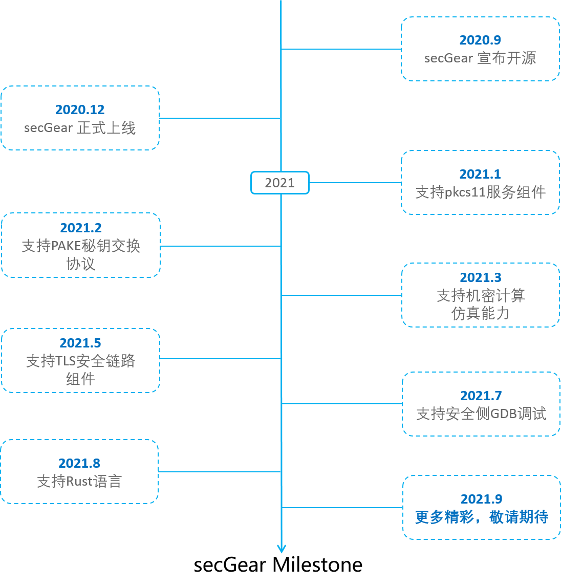



secGear
============================

Introduction
-----------

secGear is an SDK to develop confidential computing apps based on hardware enclave features. The target is to use
single source code for developers to develop apps running on different hardware. Currently secGear support Intel SGX
and iTrustee running in ARM Trustzone.

Build and Install
----------------

- [reference build & install](./docs/build_install.md)

Develop Application and Compile
------------------------------

Assuming the development directory is .../secGear/examples/test/
	
### 1 Write edl interface description
	
	enclave {
		include "secgear_urts.h"
		from "secgear_tstdc.edl" import *;
		trusted {
			public int get_string([out, size=32]char *buf);
		};
	};

include "secgear_urts.h", from "secgear_tstdc.edl" import *, to shield the difference between sgx and iTrustee when
calling the C library. So as long as you use the c library functions, for the consistency of your development code,
the default is to import these two files.

For details about edl syntax, please refer to the sgx development document Enclave Definition Language Syntax section.
At present, sgx and iTrustee are compatible with each other in basic types, pointer buffers, and deep copy of
structures, but currently only sgx supports such things as user_check, Granting Access to ECALLs, Using Switchless
Calls and so on.

Then save as test.edl

### 2 Write the top-level CMakeLists.txt

	cmake_minimum_required(VERSION 3.12 FATAL_ERROR)
	project(TEST  C)
	set(CMAKE_C_STANDARD 99)
	set(CURRENT_ROOT_PATH ${CMAKE_CURRENT_SOURCE_DIR})
	set(EDL_FILE test.edl)
	set(LOCAL_ROOT_PATH "$ENV{CC_SDK}")
        set(SECGEAR_INSTALL_PATH /lib64/)
	if(CC_GP)
		set(CODETYPE trustzone)
		set(CODEGEN codegen_arm64)
		execute_process(COMMAND uuidgen -r OUTPUT_VARIABLE UUID)
		string(REPLACE "\n" "" UUID ${UUID})
		add_definitions(-DPATH="/data/${UUID}.sec")
	endif()
	if(CC_SGX)
		set(CODETYPE sgx)
		set(CODEGEN codegen_x86_64)
		add_definitions(-DPATH="${CMAKE_CURRENT_BINARY_DIR}/enclave/enclave.signed.so")
	endif()
	add_subdirectory(${CURRENT_ROOT_PATH}/enclave)
	add_subdirectory(${CURRENT_ROOT_PATH}/host)

Set the CODETYPE EDL_FILE and CODETYPE attributes, which will be used when automatically generated later.
On the arm platform, the build enclave image needs to be named with a unique UUID, so it is dynamically uniquely
generated using the uuidgen command. The defined DPATH macro is used when loading the enclave image.

### 3 Write the non-secure side code and CMakeLists.txt
	
#### 3.1 Create a new host directory and write main.c

	#include <stdio.h>
	#include "enclave.h"
	#include "test_u.h"

	#define BUF_LEN 32

	int main()
	{
		int  retval = 0;
		char *path = PATH;
		char buf[BUF_LEN];
		cc_enclave_t *context = NULL;
		cc_enclave_result_t res;
		
		res = cc_enclave_create(path, AUTO_ENCLAVE_TYPE, 0, SECGEAR_DEBUG_FLAG, NULL, 0, &context);
		...

		res = get_string(context, &retval, buf);
		if (res != CC_SUCCESS || retval != (int)CC_SUCCESS) {
			printf("Ecall enclave error\n");
		} else {
			printf("%s\n", buf);
		}

		if (context != NULL) {
			res = cc_enclave_destroy(context);
			...
		}
		return res;
	}
	
#include "enclave.h", import the secGear header file, #include "test_u.h" import the automatically generated code
header file. Next, call cc_enclave_create(...) to create the enclave context, and then call the wrapper of the
interface described in the edl file to enter the enclave to execute confidential code.
Finally, call cc_enclave_destroy(...) to destroy the enclave context.
	
Note that the interface called here has more context and retval parameters than defined in edl file before.
This is because this function, generated by the automatic code generation tool according to edl, is a wrapper about
the real enclave code,  and its declaration is in the test_u.h header file. Where the context parameter it is the
cc_enclave_t * context created before, and retval is the return value of the function defined in edl, and the res
parameter is the return value of the wrapped function. The prefix of test_u.h is consistent with the prefix of test.edl.

If the function defined in edl does not return a value, such as "public void get_string([out, size=32]char *buf);",
then the prototype called by the user will be "res = get_string(context, buf);".

According to these rules, you can write code when the wrapper function is not generated by code generation tool and
place the wrapper function generation in the compilation phase, which simplifies the development and compilation steps.

### 3.2 Write the CMakeLists.txt file of the host.

	#set auto code prefix
	set(PREFIX test)
	#set host exec name
	set(OUTPUT secgear_test)
	#set host src code
	set(SOURCE_FILE ${CMAKE_CURRENT_SOURCE_DIR}/main.c)

Set some variables, which are described in comments.

	#set auto code
	if(CC_GP)
		set(AUTO_FILES  ${CMAKE_CURRENT_BINARY_DIR}/${PREFIX}_u.h ${CMAKE_CURRENT_BINARY_DIR}/${PREFIX}_u.c ${CMAKE_CURRENT_BINARY_DIR}/${PREFIX}_args.h)
		add_custom_command(OUTPUT ${AUTO_FILES}
		DEPENDS ${CURRENT_ROOT_PATH}/${EDL_FILE}
		COMMAND ${CODEGEN} --${CODETYPE} --untrusted ${CURRENT_ROOT_PATH}/${EDL_FILE} --search-path ${LOCAL_ROOT_PATH}/inc/host_inc/gp)
	endif()

	if(CC_SGX)
		set(AUTO_FILES  ${CMAKE_CURRENT_BINARY_DIR}/${PREFIX}_u.h ${CMAKE_CURRENT_BINARY_DIR}/${PREFIX}_u.c)
		add_custom_command(OUTPUT ${AUTO_FILES}
		DEPENDS ${CURRENT_ROOT_PATH}/${EDL_FILE}
		COMMAND ${CODEGEN} --${CODETYPE} --untrusted ${CURRENT_ROOT_PATH}/${EDL_FILE} --search-path ${LOCAL_ROOT_PATH}/inc/host_inc/sgx  --search-path ${SGXSDK}/include)
	endif()

Use the code generation tool to generate auxiliary code based on the edl. Variables such as CODEGEN and CODETYPE are
defined at the top of CMakeList.txt. --search-path is used to search for other edl files imported in test.edl.
When SGX is used, the edl imported in test.edl indirectly depends on the edl of the SGX SDK. Therefore, the search
path of the SGX SDK is also specified here.

	set(CMAKE_C_FLAGS "-fstack-protector-all -W -Wall -Werror -Wextra -Werror=array-bounds -D_FORTIFY_SOURCE=2 -O2 -ftrapv -fPIE")
	set(CMAKE_EXE_LINKER_FLAGS    "-Wl,-z,relro -Wl,-z,now -Wl,-z,noexecstack")

Set compile and link options
	
	if(CC_GP)
		if(${CMAKE_VERSION} VERSION_LESS "3.13.0")
			link_directories(${SECGEAR_INSTALL_PATH})
		endif()
		add_executable(${OUTPUT} ${SOURCE_FILE} ${AUTO_FILES})
		target_include_directories(${OUTPUT} PRIVATE
						${LOCAL_ROOT_PATH}/inc/host_inc
						${LOCAL_ROOT_PATH}/inc/host_inc/gp
						${CMAKE_CURRENT_BINARY_DIR})
		if(${CMAKE_VERSION} VERSION_GREATER_EQUAL "3.13.0")
			target_link_directories(${OUTPUT} PRIVATE ${SECGEAR_INSTALL_PATH})
		endif()
		target_link_libraries(${OUTPUT} secgear)
	endif()

In the case of iTrustee, set the search paths of the header file and the link file, and compile the final non-secure binary.

	if(CC_SGX)
		if(${CMAKE_VERSION} VERSION_LESS "3.13.0")
			link_directories(${SECGEAR_INSTALL_PATH}  ${SGXSDK}/lib64)
		endif()
		set(SGX_MODE HW)
		if(${SGX_MODE} STREQUAL HW)
			set(Urts_Library_Name sgx_urts)
		else()
			set(Urts_Library_Name sgx_urts_sim)
		endif()
		add_executable(${OUTPUT} ${SOURCE_FILE} ${AUTO_FILES})
		target_include_directories(${OUTPUT} PRIVATE
							${LOCAL_ROOT_PATH}/inc/host_inc
							${LOCAL_ROOT_PATH}/inc/host_inc/sgx
							${CMAKE_CURRENT_BINARY_DIR})
		if(${CMAKE_VERSION} VERSION_GREATER_EQUAL "3.13.0")
			target_link_directories(${OUTPUT} PRIVATE ${SECGEAR_INSTALL_PATH}  ${SGXSDK}/lib64)
		endif()
		target_link_libraries(${OUTPUT} secgear ${Urts_Library_Name})
	endif()

In the case of sgx, set the search paths of the header file and the link file, and compile the final non-secure binary.
Note: multi-threading capabilities of sgx require ocall support. In this version, this difference is not eliminated 
about multi-threading, so you need to link to sgx_urts or sgx_urts_sim. These improvements will be completed in the next version.

	set_target_properties(${OUTPUT} PROPERTIES SKIP_BUILD_RPATH TRUE)
	if(CC_GP)
		install(TARGETS  ${OUTPUT}
				RUNTIME
				DESTINATION /vendor/bin/
				PERMISSIONS OWNER_EXECUTE OWNER_WRITE OWNER_READ)
	endif()
	if(CC_SGX)
		install(TARGETS  ${OUTPUT}
				RUNTIME
				DESTINATION ${CMAKE_BINARY_DIR}/bin/
				PERMISSIONS OWNER_EXECUTE OWNER_WRITE OWNER_READ)
	endif()

Specify the installation path of the final binary. The non-secure side image of iTrustee must be installed on the
specified whitelist. The whitelist configuration will be introduced below.

### 4 Write security side code, CMakeLists.txt and some configuration files
	
#### 4.1 Create a new enclave directory and write hello.c

	#include <stdio.h>
	#include <string.h>
	#include "test_t.h"

	#define TA_HELLO_WORLD        "secGear hello world!"
	#define BUF_MAX 32
	int get_string(char *buf)
	{
		strncpy(buf, TA_HELLO_WORLD, strlen(TA_HELLO_WORLD) + 1);
		return 0;
	}

Import the test_t.h generated by the automatic code generation tool, and then write the function according to the
interface description in test.edl.
	
#### 4.2 Write CMakeLists.txt

	#set auto code prefix
	set(PREFIX test)
	#set sign key
	set(PEM Enclave_private.pem)

Set the name used to sign the enclave private key

	#set sign tool
	set(SIGN_TOOL ${LOCAL_ROOT_PATH}/tools/sign_tool/sign_tool.sh)
	#set enclave src code
	set(SOURCE_FILES ${CMAKE_CURRENT_SOURCE_DIR}/hello.c)
	#set log level
	set(PRINT_LEVEL 3)
	add_definitions(-DPRINT_LEVEL=${PRINT_LEVEL})

Set sign tool and the security side log printing level

	if(CC_GP)
            #set signed output
            set(OUTPUT ${UUID}.sec)
            #set itrustee device key
            set(DEVICEPEM ${CMAKE_CURRENT_SOURCE_DIR}/rsa_public_key_cloud.pem)

            set(WHITE_LIST_0 /vendor/bin/helloworld)
            set(WHITE_LIST_1 /vendor/bin/secgear_test)
            set(WHITE_LIST_OWNER root)
            set(WHITELIST WHITE_LIST_0 WHITE_LIST_1)

            set(AUTO_FILES  ${CMAKE_CURRENT_BINARY_DIR}/${PREFIX}_t.h ${CMAKE_CURRENT_BINARY_DIR}/${PREFIX}_t.c ${CMAKE_CURRENT_BINARY_DIR}/${PREFIX}_args.h)
            add_custom_command(OUTPUT ${AUTO_FILES}
            DEPENDS ${CURRENT_ROOT_PATH}/${EDL_FILE}
            COMMAND ${CODEGEN} --${CODETYPE} --trusted ${CURRENT_ROOT_PATH}/${EDL_FILE} --search-path ${LOCAL_ROOT_PATH}/inc/host_inc/gp)
	endif()

WHITE_LIS_X sets the whitelist of itrustee, only the host binary of these paths can call this secure image,
and up to 8 list paths can be configured. WHITE_LIST_OWNER set user, this user will be applied to all whitelist paths.
DEVICEPEM public key is used by itrustee and is used to encrypt the enclave image of the security side with the
dynamically generated aes key. Finally, set the name of the security side image after the final signature, and
generate auxiliary code.

	if(CC_SGX)
	        set(OUTPUT enclave.signed.so)
	        set(AUTO_FILES  ${CMAKE_CURRENT_BINARY_DIR}/${PREFIX}_t.h ${CMAKE_CURRENT_BINARY_DIR}/${PREFIX}_t.c)
	        add_custom_command(OUTPUT ${AUTO_FILES}
	        DEPENDS ${CURRENT_ROOT_PATH}/${EDL_FILE}
	        COMMAND ${CODEGEN} --${CODETYPE} --trusted ${CURRENT_ROOT_PATH}/${EDL_FILE} --search-path ${LOCAL_ROOT_PATH}/inc/host_inc/sgx --search-path ${SGXSDK}/include)
	endif()

In the case of sgx, set the name of the security side image after the final signature, and generate auxiliary code.

	set(COMMON_C_FLAGS "-W -Wall -Werror  -fno-short-enums  -fno-omit-frame-pointer -fstack-protector \
			-Wstack-protector --param ssp-buffer-size=4 -frecord-gcc-switches -Wextra -nostdinc -nodefaultlibs \
			-fno-peephole -fno-peephole2 -Wno-main -Wno-error=unused-parameter \
			-Wno-error=unused-but-set-variable -Wno-error=format-truncation=")

	set(COMMON_C_LINK_FLAGS "-Wl,-z,now -Wl,-z,relro -Wl,-z,noexecstack -Wl,-nostdlib -nodefaultlibs -nostartfiles")
	
Set the security side, no matter whether it is sgx or itrustee will use some compilation and link options, for
example, because the security side is different from the non-secure side, the default library of host OS cannot be used,
so -nostdinc -nodefaultlibs -nostdlib -nodefaultlibs compile link options was introduced.

	if(CC_GP)
		configure_file("${CMAKE_CURRENT_SOURCE_DIR}/manifest.txt.in" "${CMAKE_CURRENT_SOURCE_DIR}/manifest.txt")

		set(CMAKE_C_FLAGS "${COMMON_C_FLAGS}  -march=armv8-a ")
		set(CMAKE_C_FLAGS_RELEASE "${CMAKE_C_FLAGS}  -s -fPIC")
		set(CMAKE_SHARED_LINKER_FLAGS  "${COMMON_C_LINK_FLAGS} -Wl,-s")

		set(ITRUSTEE_TEEDIR ${iTrusteeSDK}/)
		set(ITRUSTEE_LIBC ${iTrusteeSDK}/thirdparty/open_source/musl/libc)

		if(${CMAKE_VERSION} VERSION_LESS "3.13.0")
			link_directories(${SECGEAR_INSTALL_PATH})
		endif()

		add_library(${PREFIX} SHARED ${SOURCE_FILES} ${AUTO_FILES})

		target_include_directories( ${PREFIX} PRIVATE
			${CMAKE_CURRENT_BINARY_DIR}
			${LOCAL_ROOT_PATH}/inc/host_inc
			${LOCAL_ROOT_PATH}/inc/host_inc/gp
			${LOCAL_ROOT_PATH}/inc/enclave_inc
			${LOCAL_ROOT_PATH}/inc/enclave_inc/gp
			${ITRUSTEE_TEEDIR}/include/TA
			${ITRUSTEE_TEEDIR}/include/TA/huawei_ext
			${ITRUSTEE_LIBC}/arch/aarch64
			${ITRUSTEE_LIBC}/
			${ITRUSTEE_LIBC}/arch/arm/bits
			${ITRUSTEE_LIBC}/arch/generic
			${ITRUSTEE_LIBC}/arch/arm
			${LOCAL_ROOT_PATH}/inc/enclave_inc/gp/itrustee)

		if(${CMAKE_VERSION} VERSION_GREATER_EQUAL "3.13.0")
			target_link_directories(${PREFIX} PRIVATE ${SECGEAR_INSTALL_PATH})
		endif()

		foreach(WHITE_LIST ${WHITELIST})
			add_definitions(-D${WHITE_LIST}="${${WHITE_LIST}}")
		endforeach(WHITE_LIST)
		add_definitions(-DWHITE_LIST_OWNER="${WHITE_LIST_OWNER}")

		target_link_libraries(${PREFIX} -lsecgear_tee)

		add_custom_command(TARGET ${PREFIX}
			POST_BUILD
			COMMAND bash ${SIGN_TOOL} -d sign -x 2 -i lib${PREFIX}.so -m ${CMAKE_CURRENT_SOURCE_DIR}/manifest.txt
			-e ${DEVICEPEM} -o ${CMAKE_CURRENT_BINARY_DIR}/${OUTPUT})

		install(FILES ${CMAKE_CURRENT_BINARY_DIR}/${OUTPUT}
			DESTINATION /data
			PERMISSIONS OWNER_EXECUTE OWNER_WRITE OWNER_READ GROUP_READ GROUP_EXECUTE  WORLD_READ  WORLD_EXECUTE)

	endif()

In the case of iTrustee, generate the configuration file manifest.tx, which details of the configuration file will
be explained later, specify some compilation options related to itrustee, set the search paths of the header file and
the link file, and compile the enclave binary.

Regarding the use of itrustee ocall, there are some other notes, which will be introduced later. Then define the
whitelist macro. Next, you need to link to the secgear_tee library, in which there are interfaces for generating
random numbers, seal, unseal, etc. The last step is to sign and install.

	if(CC_SGX)
		set(SGX_MODE HW)
		set(SGX_DIR ${SGXSDK})
		set(CMAKE_C_FLAGS "${COMMON_C_FLAGS} -m64 -fvisibility=hidden")
		set(CMAKE_C_FLAGS_RELEASE "${CMAKE_C_FLAGS}  -s")
		set(LINK_LIBRARY_PATH ${SGX_DIR}/lib64)

		if(${SGX_MODE} STREQUAL HW)
			set(Trts_Library_Name sgx_trts)
			set(Service_Library_Name sgx_tservice)
		else()
			set(Trts_Library_Name sgx_trts_sim)
			set(Service_Library_Name sgx_tservice_sim)
		endif()

		set(Crypto_Library_Name sgx_tcrypto)

		set(CMAKE_SHARED_LINKER_FLAGS  "${COMMON_C_LINK_FLAGS} -Wl,-z,defs -Wl,-pie -Bstatic -Bsymbolic -eenclave_entry \
			-Wl,--export-dynamic -Wl,--defsym,__ImageBase=0 -Wl,--gc-sections -Wl,--version-script=${CMAKE_CURRENT_SOURCE_DIR}/Enclave.lds")

		if(${CMAKE_VERSION} VERSION_LESS "3.13.0")
			link_directories(${LINK_LIBRARY_PATH})
		endif()

		add_library(${PREFIX}  SHARED ${SOURCE_FILES} ${AUTO_FILES})

		target_include_directories(${PREFIX} PRIVATE
				${CMAKE_CURRENT_BINARY_DIR}
				${SGX_DIR}/include/tlibc
				${SGX_DIR}/include/libcxx
				${SGX_DIR}/include
				${LOCAL_ROOT_PATH}/inc/host_inc
				${LOCAL_ROOT_PATH}/inc/host_inc/sgx)

		if(${CMAKE_VERSION} VERSION_GREATER_EQUAL "3.13.0")
			target_link_directories(${PREFIX} PRIVATE
					${LINK_LIBRARY_PATH})
		endif()

		target_link_libraries(${PREFIX}  -Wl,--whole-archive ${Trts_Library_Name} -Wl,--no-whole-archive
					-Wl,--start-group -lsgx_tstdc -lsgx_tcxx -l${Crypto_Library_Name} -l${Service_Library_Name}   -Wl,--end-group)
		add_custom_command(TARGET ${PREFIX}
		POST_BUILD
		COMMAND openssl genrsa -3 -out ${PEM} 3072
		COMMAND bash ${SIGN_TOOL} -d sign -x 1 -i lib${PREFIX}.so -k ${PEM} -o ${OUTPUT} -c ${CMAKE_CURRENT_SOURCE_DIR}/Enclave.config.xml)
	endif()

In the case of sgx, specify some compilation, link options related to sgx.  When linking libraries, sgx and itrustee
are quite different. This is because itrustee is a secure OS with more capabilities, such as musl libc and openssl.
When compiling and link itrustee's enclave, there is no need to link some basic libraries. But sgx has no OS concept.
The basic library interfaces to be called on the security side are all given in the sgx sdk in the form of static
libraries, so this requires us to link these static libraries, and in order to be able to use these static libraries
correctly, some libraries must be linked between specified options, such as sgx_trts.

For more detailed information, please refer to the Makefile of sgx examples. Finally, sign the enclave with the
configuration file, which will be introduced later. Note that secGear does not currently support remote authentication.
	
	set_target_properties(${PREFIX} PROPERTIES SKIP_BUILD_RPATH TRUE)
	
Set some safe compilation options.
	
#### 4.3 Enclave image configuration file
	
Write sgx enclave related configuration files
The configuration content in the Enclave.config.xml and Enclave.lds files is the same as the official sgx
configuration file.  For details, please refer to the official development document.

Write itrustee related configuration files
The gpd.ta.appID in the manifest.txt.in file is the uuid configuration item, which is dynamically generated, 
and the other configuration items can refer to the itrustee development document.

Copy the rsa_public_key_cloud.pem device public key from other examples in the project to the enclave directory.
The device public key here is used to encrypt the enclave image with the temporarily generated aes key.
	
### 5 build and install test

Enter the development directory .../secGear/examples/test/, then run mkdir debug && cd debug
&& cmake -DCMAKE_BUILD_TYPE=Debug -DCC_SGX=ON -DSGXSDK=sgx_sdk path .. &&  make && sudo make install OR
mkdir debug && cd debug && cmake -DCMAKE_BUILD_TYPE=Debug -DCC_GP=ON -DiTrusteeSDK=gp_sdk path .. && make
&& sudo make install

Log
---
Non-secure side log record:

Non-secure side development, similar to ordinary development, users can implement non-secure side application logs
by themselves

Security side log record:

Security side development, due to restrictions on the different security capabilities of each platform, it is
impossible to directly develop the log function like the non-secure side, Therefore, we provide the PrintInfo
interface to record the security side log to the Syslog system. The related configuration files secgear and secgear.conf
have been installed in the system directory during the build and install secGear phase.
	
Note that when using on itrustee, you need to import the secgear_log.h header file, but sgx does not need it.
Because sgx implements the log function through ocall, the relevant code is in the auxiliary code. And when the
configuration file is installed, you need to run "systemctl restart rsyslog"  to make the log effective.

Finally, in order to enable itrustee logs to be dumped to the place specified in the configuration file, you also
need to run /vendor/bin/tlogcat -f. The tlogcat tool is a part of the itrustee sdk.
	
The meaning of log level (set(PRINT_LEVEL 3)). 

    PRINT_ERROR    0
    PRINT_WARNING  1
    PRINT_STRACE   2
    PRINT_DEBUG    3

At present, there are some differences in the usage of the log function. After the itrustee ocall function is stable,
the usage will be unified.

Use ocall
---------

The secGear ocall function can be used normally on the sgx platform. There are currently restrictions on itrustee:

    only the specified a3d88d2a-ae2a-4ea5-a37d-35fc5f607e9e uuid can be used, 
    and two programs that enable ocall cannot be run at the same time, 
    and config cannot be enabled. ta.instanceKeepAlive.
	
Moreover, if the underlying itrustee does not enable ocall, the SDK will only report an error registration ocall failure,
and the ecall function can be used normally.

Seal, generate random number interface
--------------------------------------

The related interface is defined in secgear_dataseal.h, secgear_random.h. For usage, please refer to examples/seal_data.
Note: Since the feature for itrustee to derive keys is still not perfect, seal related interfaces are not currently
supported on the itrustee platform.

Remote authentication capability is currently not supported.
------------------------------------------------------------

secGear does not currently support plc, switchless and other about sgx features.
--------------------------------------------------------------------------------

Learning More About codegener
----------------------------

secGear Introduce EDL (Enclave Description Languate) and intermediate code generation tool codegener. EDL is
compatible with Intel SGX's definition.

- [Learn how to use codegener](./docs/codegener.md)

Learning More About sign_tool
-----------------------------

secGear introduce the signing tool to sign the enclave.

- [Learn how to use signing tool](./docs/sign_tool.md)

Milestone
---------

