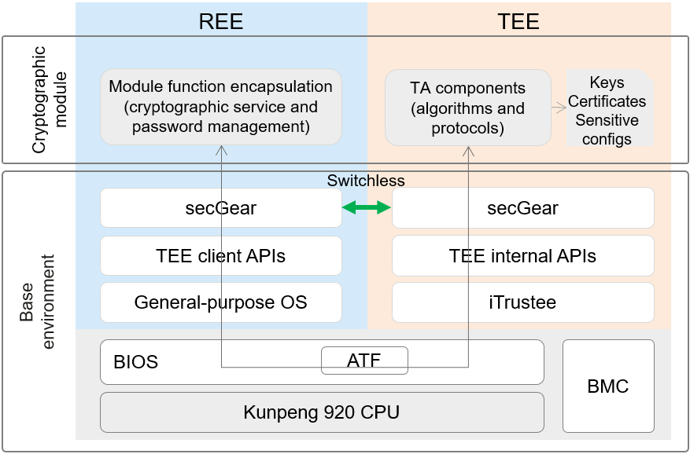
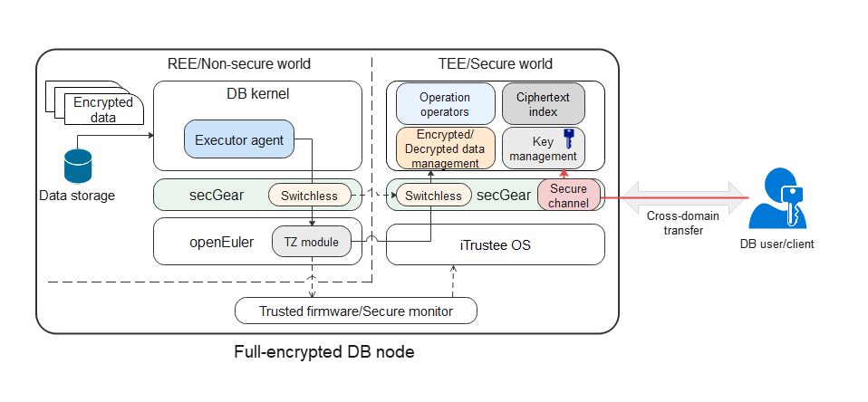
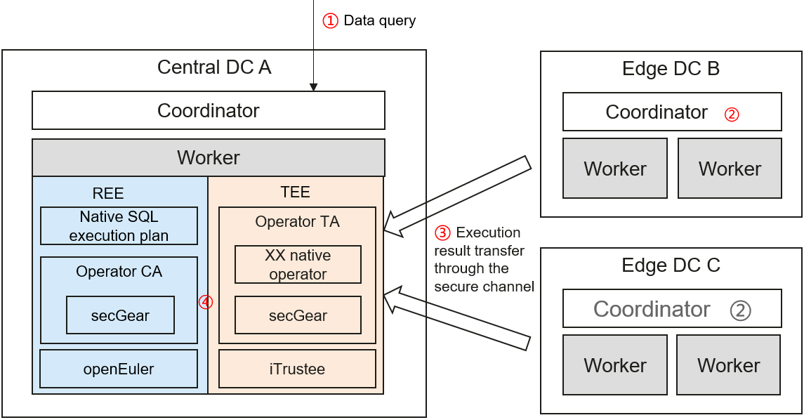
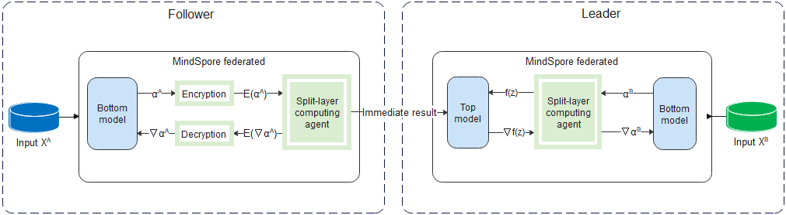
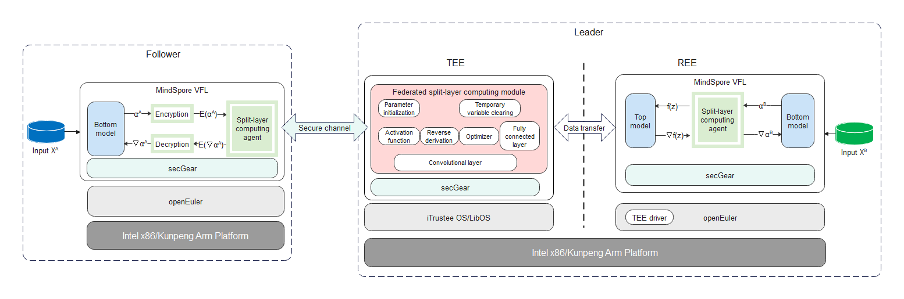

# Application Scenarios

This chapter describes confidential computing solutions in typical scenarios with examples, helping you understand the application scenarios of secGear and build confidential computing solutions based on your services.

## TEE-based BJCA Cryptographic Module

Driven by policies and services, the cryptographic application assurance infrastructure has been evolving towards virtualization. As services are migrated to the cloud, a brand-new cryptographic delivery mode needs to be built to integrate cryptographic services, cloud services, and service applications. Under such circumstance, Beijing Certificate Authority (BJCA) launches a TEE-based cryptographic module. BJCA can not only use the Kunpeng-based TEEs to build compliant cryptographic computing modules to support cryptographic cloud service platforms, but also build a confidential computing platform based on Kunpeng hosts to provide high-speed ubiquitous, elastically deployed, and flexibly scheduled cryptographic services for various scenarios such as cloud computing, privacy computing, and edge computing. The endogenous cryptographic module based on Kunpeng processors has become a revolutionary innovative solution in the cryptographic industry, and becomes a new starting point for endogenous trusted cryptographic computing.

### Status Quo

In conventional cryptographic modules, algorithm protocols and processed data are privacy data. Migrating cryptographic modules to the cloud has security risks.

### Solution

The figure shows a TEE-based cryptographic module solution. secGear can divide the cryptographic module into two parts: management service and algorithm protocol.

- Management service: runs on the REE to provide cryptographic services for the external world and forward requests to the TEE for processing.
- Algorithm protocol: runs on the TEE to encrypt and decrypt user data.

Cryptographic services may have highly concurrent requests with large data volumes. The switchless feature of secGear reduces the context switches and data copies typically required for processing a large number of requests between the REE and TEE.

## TEE-based Fully-Encrypted GaussDB

Cloud databases have become an important growth point for database services in the future. Most traditional database service vendors are accelerating the provision of better cloud database services. However, cloud databases face more complex and diversified risks than traditional databases. Application vulnerabilities, system configuration errors, and malicious administrators may pose great risks to data security and privacy.

### Status Quo

The deployment network of cloud databases changes from a private environment to an open environment. The system O&M role is divided into service administrators and O&M administrators. Service administrators have service management permissions and belong to the enterprise service provider. O&M administrators belong to the cloud service provider. Although being defined to be responsible only for system O&M management, the database O&M administrator still has full permissions to use data. The database O&M administrator can access or even tamper with data with O&M management permissions or privilege escalation. In addition, due to the open environment and blurring of network boundaries, user data is more fully exposed to attackers in the entire service process, no matter in transfer, storage, O&M, or running. Therefore, in cloud database scenarios, how to solve the third-party trust problem and how to protect data security more reliably are facing greater challenges than traditional databases. Data security and privacy leakage are top concerns of cloud databases.

### Solution

To address the preceding challenges, the TEE-based fully-encrypted GaussDB (openGauss) is designed as follows: Users hold data encryption and decryption keys, data is stored in ciphertext in the entire life cycle of the database service, and query operations are completed in the TEE of the database service.

The figure shows the TEE-based fully-encrypted database solution. The fully-encrypted database has the following features:

1. Data files are stored in ciphertext and plaintext key information is not stored.
2. The database data key is stored on the client.
3. When the client initiates a query request, the REE executes the encrypted SQL syntax on the server to obtain related ciphertext records and sends them to the TEE.
4. The client encrypts and transfers the database data key to the server TEE through the secure channel of secGear. The database data key is decrypted in the TEE and used to decrypt the ciphertext records into plaintext records. The SQL statement is executed to obtain the query result. Then the query result is encrypted using the database data key and sent back to the client.

In step 3, when a large number of concurrent database requests are sent, frequent calls between the REE and TEE will be triggered and a large amount of data needs to be transferred. As a result, the performance deteriorates sharply. The switchless feature of secGear helps reduce context switches in calls and data copies, improving the performance.

## TEE-based openLooKeng Federated SQL

openLooKeng federated SQL is a type of cross-DC query. The typical scenario is as follows. There are three DCs: central DC A, edge DC B, and edge DC C. The openLooKeng cluster is deployed in the three DCs. When receiving a cross-domain query request, DC A delivers an execution plan to each DC. After the openLookeng clusters in edge DCs B and C complete computing, the result is transferred to the openLookeng cluster in DC A over the network to complete aggregation computing.

### Status Quo

In the preceding solution, the computing result is transferred between openLookeng clusters in different DCs, avoiding insufficient network bandwidth and solving the cross-domain query problem to some extent. However, the computing result is obtained from the original data and may contain sensitive information. As a result, security and compliance risks exist when data is transferred out of the domain. How do we protect the computing results of the edge DCs during aggregation computing and ensure that the computing results are available but invisible in the central DC?

### Solution

In DC A, the openLookeng cluster splits the aggregation computing logic and operators into independent modules and deploys them in the Kunpeng-based TEE. The computing results of the edge DCs are transferred to the TEE of DC A through the secure channel. All data is finally aggregated and computed in the TEE. In this way, the computing results of the edge DCs are protected from being obtained or tampered with by privileged or malicious programs in the REE of DC A during aggregation computing.

The figure shows the TEE-based federated SQL solution. The query process is as follows:

1. A user delivers a cross-domain query request in DC A. The coordinator of openLooKeng splits and delivers the execution plan to its worker nodes and the coordinators of edge DCs based on the query SQL statement and data distribution. Then the coordinators of edge DCs deliver the execution plan to their worker nodes.
2. Each worker node executes the plan to obtain the local computing result.
3. Edge DCs encrypt their computing results through the secure channel of secGear, transfer the results to the REE of DC A over the Internet, forward the results to the TEE, and decrypt the results in the TEE.
4. DC A performs aggregation computing on the computing results of DCs A, B, and C in the TEE, obtains a final execution result, and returns the result to the user.

In step 4, when there are a large number of query requests, the REE and TEE will be frequently invoked and a large amount of data is copied. As a result, the performance deteriorates. The switchless feature of secGear is optimized to reduce context switches and data copies to improve the performance.

## TEE-based MindSpore Feature Protection

Vertical federated learning (VFL) is an important branch of federated learning. When multiple parties have features about the same set of users, VFL can be used for collaborative training.

### Status Quo

The figure shows the data processing flow of the traditional solution.

1. A party that has features is also called a follower, while a party that has labels is also called a leader. Each follower inputs its features to its bottom model to obtain the intermediate result, and then sends the intermediate result to the leader.
2. The leader uses its labels and the intermediate results of followers to train the top model, and then sends the computed gradient back to the followers to train their bottom models.

This solution prevents followers from directly uploading their raw data out of the domain, thereby protecting data privacy. However, attackers may derive user information from the uploaded intermediate results, causing privacy leakage risks. Therefore, a stronger privacy protection solution is required for intermediate results and gradients to meet security compliance requirements.

### Solution

Based on the security risks and solutions in the previous three scenarios, confidential computing is a good choice to make intermediate results "available but invisible" out of the domain.

The figure shows the TEE-based VFL feature protection solution. The data processing process is as follows:

1. Followers encrypt their intermediate results through the secure channel of secGear and transfer the results to the leader. After receiving the results, the leader transfers them to the TEE and decrypts them through the secure channel in the TEE.
2. In the TEE, the intermediate results are input to the computing module at the federated split layer to compute the result.

In this process, the plaintext intermediate results of followers exist only in the TEE memory, which is inaccessible to the leader, like a black box.
