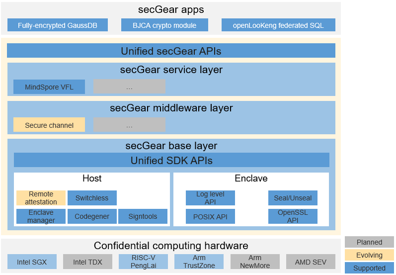

# Introduction to secGear

## Overview

With the rapid development of cloud computing, more and more enterprises deploy computing services on the cloud. The security of user data on the third-party cloud infrastructure is facing great challenges. Confidential computing is a technology that uses hardware-based trusted execution environments (TEEs) to protect confidentiality and integrity of data in use. It relies on the bottom-layer hardware to build the minimum trust dependency, which removes the OS, hypervisor, infrastructure, system administrator, and service provider from the trusted entity list as unauthorized entities to reduce potential risks. There are various confidential computing technologies (such as Intel SGX, Arm TrustZone, and RISC-V Keystone) and software development kits (SDKs) in the industry and the application ecosystem of different TEEs are isolated from each other, which brings high development and maintenance costs to confidential computing application developers. To help developers quickly build confidential computing solutions that protect data security on the cloud, openEuler launches the unified confidential computing programming framework secGear.

## Architecture



The architecture of secGear consists of three layers that form the foundation of openEuler confidential computing software.

- Base layer: The unified layer of the confidential computing SDK provides APIs for different TEEs, enabling different architectures to share the same set of source code.
- Middleware layer: The general component layer provides confidential computing software for users to quickly build confidential computing solutions.
- Server layer: The confidential computing service layer runs dedicated solutions for typical situations.

## Key Features

### Switchless

#### Pain Points

After a conventional application is reconstructed using confidential computing, the rich execution environment (REE) logic frequently invokes the TEE logic or the REE frequently exchanges large data blocks with the TEE. Each call between the REE and TEE requires context switching among the REE user mode, REE kernel mode, driver, TEE kernel mode, and TEE user mode. When large blocks of data are exchanged during the call, multiple memory copies are generated. In addition, the interaction performance between the REE and TEE deteriorates due to factors such as the size limit of underlying data blocks, which severely affects the implementation of confidential computing applications.

#### Solution

Switchless is a technology that uses shared memory to reduce the number of context switches and data copies between the REE and TEE to optimize the interaction performance.

#### How to Use

1. Enable switchless when creating an enclave.

  The configuration items of switchless are described as follows:

  ```c
  typedef struct {
   uint32_t num_uworkers;
   uint32_t num_tworkers;
   uint32_t switchless_calls_pool_size;
   uint32_t retries_before_fallback;
   uint32_t retries_before_sleep;
   uint32_t parameter_num;
   uint32_t workers_policy;
   uint32_t rollback_to_common;
   cpu_set_t num_cores;
  } cc_sl_config_t;
  ```

  | Configuration Item         | Description                                                                                                                                                                                                                                                                                                                                                                                                                                                                                                                                                                        |
  | -------------------------- | ---------------------------------------------------------------------------------------------------------------------------------------------------------------------------------------------------------------------------------------------------------------------------------------------------------------------------------------------------------------------------------------------------------------------------------------------------------------------------------------------------------------------------------------------------------------------------------- |
  | num_uworkers               | Number of proxy worker threads in the REE, which are used to make switchless out calls (OCALLs). Currently, this field takes effect only on the SGX platform and can be configured on the Arm platform. However, because the Arm platform does not support OCALLs, the configuration does not take effect on the Arm platform.<br>Specifications:<br>Arm: maximum value: **512**; minimum value: **1**; default value: **8** (used when this field is set to **0**).<br>SGX: maximum value: **4294967295**; minimum value: **1**.                                               |
  | num_tworkers               | Number of proxy worker threads in the TEE, which are used to make switchless enclave calls (ECALLs).<br>Specifications:<br>Arm: maximum value: **512**; minimum value: **1**; default value: **8** (used when this field is set to **0**).<br>SGX: maximum value: **4294967295**; minimum value: **1**.                                                                                                                                                                                                                                                                         |
  | switchless_calls_pool_size | Size of the switchless call pool. The pool can contain **switchless_calls_pool_size** x 64 switchless calls. For example, if **switchless_calls_pool_size=1**, 64 switchless calls are contained in the pool.<br>Specifications:<br>Arm: maximum value: **8**; minimum value: **1**; default value: **1** (used when this field is set to **0**).<br>SGX: maximum value: **8**; minimum value: **1**; default value: **1** (used when **switchless_calls_pool_size** is set to **0**).                                                                                          |
  | retries_before_fallback    | After the **pause** assembly instruction is executed for **retries_before_fallback** times, if the switchless call is not made by the proxy worker thread on the other side, the system rolls back to the switch call mode. This field takes effect only on the SGX platform.<br>Specifications:<br>SGX: maximum value: **4294967295**; minimum value: **1**; default value: **20000** (used when this field is set to **0**).                                                                                                                                                   |
  | retries_before_sleep       | After the **pause** assembly instruction is executed for **retries_before_sleep** times, if the proxy worker thread does not receive any task, the proxy worker thread enters the sleep state. This field takes effect only on the SGX platform.<br>Specifications:<br>SGX: maximum value: **4294967295**; minimum value: **1**; default value: **20000** (used when this field is set to **0**).                                                                                                                                                                                |
  | parameter_num              | Maximum number of parameters supported by a switchless function. This field takes effect only on the Arm platform.<br>Specifications:<br>Arm: maximum value: **16**; minimum value: **0**.                                                                                                                                                                                                                                                                                                                                                                                       |
  | workers_policy             | Running mode of the switchless proxy thread. This field takes effect only on the Arm platform.<br>Specifications:<br>Arm:<br>**WORKERS_POLICY_BUSY**: The proxy thread always occupies CPU resources regardless of whether there are tasks to be processed. This mode applies to scenarios that require high performance and extensive system software and hardware resources.<br>**WORKERS_POLICY_WAKEUP**: The proxy thread wakes up only when there is a task. After the task is processed, the proxy thread enters the sleep state and waits to be woken up by a new task. |
  | rollback_to_common         | Whether to roll back to a common call when an asynchronous switchless call fails. This field takes effect only on the Arm platform.<br>Specifications:<br>Arm:<br>**0**: No. If the operation fails, only the error code is returned.<br>Other values: Yes. If the operation fails, an asynchronous switchless call is rolled back to a common call and the return value of the common call is returned.                                                                                                                                                                       |
  | num_cores                  | Number of cores for TEE core binding <br />Specifications: The maximum value is the number of cores in the environment.                                                                                                                                                                                                                                                                                                                                                                                                                                                            |

1. Add the **transition_using_threads** flag when defining the API in the enclave description language (EDL) file.

  ```ocaml
  enclave {
      include "secgear_urts.h"
      from "secgear_tstdc.edl" import *;
      from "secgear_tswitchless.edl" import *;
      trusted {
          public int get_string([out, size=32]char *buf);
          public int get_string_switchless([out, size=32]char *buf) transition_using_threads;
      };
  };
  ```

### Secure Channel

#### Pain Points

When requesting the confidential computing service on the cloud, the data owner needs to upload the data to be processed to the TEE on the cloud for processing. Because the TEE is not connected to the network, the data needs to be transferred to the REE over the network in plaintext and then transferred to the TEE from the REE. The data plaintext is exposed in the REE memory, which poses security risks.

#### Solution

A secure channel is a technology that combines confidential computing remote attestation to implement secure key negotiation between the data owner and the TEE on the cloud. It negotiates a sessionkey owned only by the data owner and the TEE on the cloud. Then the sessionkey is used to encrypt user data transferred over the network. After receiving the ciphertext data, the REE transfers the data to the TEE for decryption and processing.

#### How to Use

The secure channel is provided as a library and consists of the client, host, and enclave, which are icalled by the client, server client application (CA), and server trusted application (TA) of the service program respectively.

| Module        | Header File                     | Library File                  | Dependency     |
|------------|--------------------------|-----------------------|---------|
| Client       | secure_channel_client.h  | libcsecure_channel.so | OpenSSL|
| Host   | secure_channel_host.h    | libusecure_channel.so | OpenSSL|
| Enclave| secure_channel_enclave.h | libtsecure_channel.so | TEE and TEE software stack    |

##### APIs

| API                                                                                                                                         | Header File and Library                  | Function          | Remarks|
|----------------------------------------------------------------------------------------------------------------------------------------------|-----------------------|--------------|----|
| cc_sec_chl_client_init                                                 | secure_channel_client.h libcsecure_channel.so | Initializes the secure channel on the client.  | Before calling this API, initialize the network connection and message sending hook function in the **ctx** parameter.  |
| cc_sec_chl_client_fini                                                                                         | secure_channel_client.h libcsecure_channel.so | Destroys the secure channel on the client.   | Instructs the server to destroy the local client information and local secure channel information.  |
| cc_sec_chl_client_callback                                              | secure_channel_client.h libcsecure_channel.so | Function for processing secure channel negotiation messages.| Processes messages sent from the server to the client during secure channel negotiation. This API is called when messages are received on the client.  |
| cc_sec_chl_client_encrypt | secure_channel_client.h libcsecure_channel.so | Encryption API of the secure channel on the client.    |  None |
| cc_sec_chl_client_decrypt | secure_channel_client.h libcsecure_channel.so | Decryption API of the secure channel on the client.    |  None  |
|  int (*cc_conn_opt_funcptr_t)(void*conn, void *buf, size_t count);                                                                                                                                            |    secure_channel.h                    |    Prototype of the message sending hook function.         | Implemented by the client and server to specify the secure channel negotiation message type. It sends secure channel negotiation messages to the peer end.  |
|  cc_sec_chl_svr_init                                                                                                                                            |  secure_channel_host.h  libusecure_channel.so                    |  Initializes the secure channel on the server.           | Before calling this API, initialize **enclave_ctx** in **ctx**.  |
|  cc_sec_chl_svr_fini                                                                                                                                            |   secure_channel_host.h  libusecure_channel.so                    |  Destroys the secure channel on the server.           |  Destroys information about the secure channel on the server and all clients. |
|  cc_sec_chl_svr_callback                                                                                                                                            |  secure_channel_host.h  libusecure_channel.so                     |  Function for processing secure channel negotiation messages.           | Processes messages sent from the client to the server during security channel negotiation. This API is called when messages are received on the server. Before calling this API, you need to initialize the network connection to the client and the message sending hook function. For details, see [examples](https://gitee.com/openeuler/secGear/blob/master/examples/secure_channel/host/server.c#:~:text=conn_ctx.conn_kit.send).  |
| cc_sec_chl_enclave_encrypt                                                                                                                                             |    secure_channel_enclave.h libtsecure_channel.so                   | Encryption API of the secure channel on the enclave.            | None  |
|   cc_sec_chl_enclave_decrypt                                                                                                                                           |   secure_channel_enclave.h libtsecure_channel.so                    | Decryption API of the secure channel on the enclave.            |  None|

##### Precautions

A secure channel encapsulates only the key negotiation process and encryption and decryption APIs, but does not establish any network connection. The negotiation process reuses the network connection of the service. The network connection between the client and server is established and maintained by the service. The message sending hook function and network connection pointer are transferred during the initialization of the secure channel on the client and the server.
For details, see [secure channel examples](https://gitee.com/openeuler/secGear/tree/master/examples/secure_channel).

### Remote Attestation

#### Challenges

As confidential computing technologies advance, several major platforms have emerged, including Arm Trustzone/CCA, Intel SGX/TDX, QingTian Enclave, and Hygon CSV. Solutions often involve multiple confidential computing hardware platforms, sometimes requiring collaboration between different TEEs. Remote attestation is a crucial part of the trust chain in any confidential computing technology. However, each technology has its own attestation report format and verification process. This forces users to integrate separate verification workflows for each TEE, increasing complexity and hindering the adoption of new TEE types.

#### Solution

The unified remote attestation framework of secGear addresses the key components related to remote attestation in confidential computing, abstracting away the differences between different TEEs. It provides two components: attestation agent and attestation service. The agent is integrated by users to obtain attestation reports and connect to the attestation service. The service can be deployed independently and supports the verification of iTrustee and virtCCA remote attestation reports.

#### Feature Description

The unified remote attestation framework focuses on confidential computing functionalities, while service deployment and operation capabilities are provided by third-party deployment services. The key features of the unified remote attestation framework are as follows:

- Report verification plugin framework: Supports runtime compatibility with attestation report verification for different TEE platforms, such as iTrustee, virtCCA, and CCA. It also supports the extension of new TEE report verification plugins.
- Certificate baseline management: Supports the management of baseline values of Trusted Computing Bases (TCB) and Trusted Applications (TA) as well as public key certificates for different TEE types. Centralized deployment on the server ensures transparency for users.
- Policy management: Provides default policies for ease of use and customizable policies for flexibility.
- Identity token: Issues identity tokens for different TEEs, endorsed by a third party for mutual authentication between different TEE types.
- Attestation agent: Supports connection to attestation service/peer-to-peer attestation, compatible with TEE report retrieval and identity token verification. It is easy to integrate, allowing users to focus on their service logic.

Two modes are supported depending on the usage scenario: peer-to-peer verification and attestation service verification.

Attestation service verification process:

1. The user (regular node or TEE) initiates a challenge to the TEE platform.
2. The TEE platform obtains the TEE attestation report through the attestation agent and returns it to the user.
3. The user-side attestation agent forwards the report to the remote attestation service.
4. The remote attestation service verifies the report and returns an identity token in a unified format endorsed by a third party.
5. The attestation agent verifies the identity token and parses the attestation report verification result.
6. Upon successful verification, a secure connection is established.

Peer-to-peer verification process (without the attestation service):

1. The user initiates a challenge to the TEE platform, which then returns the attestation report to the user.
2. The user uses a local peer-to-peer TEE verification plugin to verify the report.

> [!NOTE]NOTE   
> The attestation agent varies depending on whether peer-to-peer verification or remote attestation service verification is used. Users can select the desired mode during compilation by specifying the appropriate option, enabling the attestation agent to support either the attestation service or peer-to-peer mode.

#### Application Scenarios

In scenarios like finance and AI, where confidential computing is used to protect the security of privacy data during runtime, remote attestation is a technical means to verify the legitimacy of the confidential computing environment and applications. secGear provides components that are easy to integrate and deploy, helping users quickly enable confidential computing remote attestation capabilities.

## Acronyms and Abbreviations

| Acronym/Abbreviation | Full Name                     |
| -------------------- | ----------------------------- |
| REE                  | rich execution environment    |
| TEE                  | trusted execution environment |
| EDL                  | enclave description language  |
