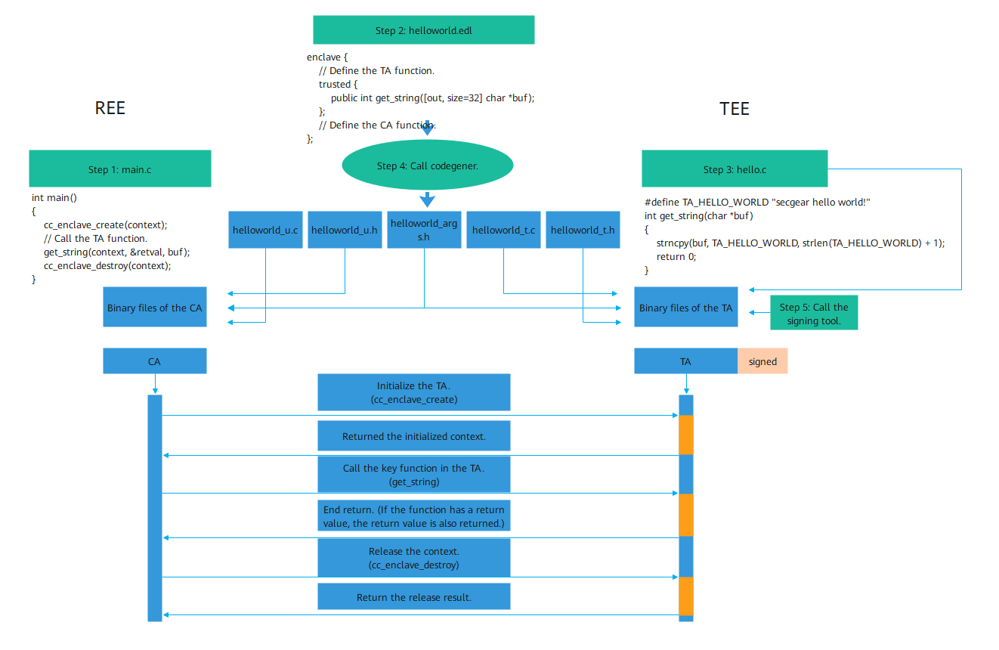

# Developer Guide

This chapter provides an example of using secGear to develop a C language program helloworld, helping you understand how to use secGear to develop applications.

## Downloading Examples

```shell
git clone https://gitee.com/openeuler/secGear.git
```

## Directory Structure

```shell
cd examples/helloworld

#Directory structure:
├── helloworld
│   ├── CMakeLists.txt
│   ├── enclave
│   │   ├── CMakeLists.txt
│   │   ├── Enclave.config.xml
│   │   ├── Enclave.lds
│   │   ├── hello.c
│   │   ├── manifest.txt
│   │   └── config_cloud.ini
│   ├── helloworld.edl
│   └── host
│       ├── CMakeLists.txt
│       └── main.c
```

The code body consists of three parts:

- **main.c**: REE program
- **helloworld.edl**: header file of the APIs called by the REE and TEE
- **hello.c**: TEE program

## Preparations

In addition to the preceding three parts, there are compilation project file (**CMakeLists.txt**) and developer licenses (**Enclave.config.xml**/**Enclave.lds** of Intel SGX and **manifest.txt**/**config_cloud.ini** of Kunpeng).

> [!NOTE]NOTE
>
> - The Kunpeng developer license needs to be [applied for from the Huawei service owner](https://www.hikunpeng.com/document/detail/en/kunpengcctrustzone/fg-tz/kunpengtrustzone_04_0009.html).
> - Because Intel SGX is debugged in debug mode, you do not need to apply for a developer license currently. If the remote attestation service of Intel is required for commercial use, you need to [apply for a license from Intel](https://www.intel.com/content/www/us/en/developer/tools/software-guard-extensions/request-license.html).

After the application is successful, the developer license file is obtained and needs to be stored in the corresponding code directory.

## Development Procedure

Reconstructing a confidential computing application based on secGear is similar to independently extracting functional modules. The procedure is as follows: Identify sensitive data processing logic, extract it into an independent library, deploy it in the TEE, and define APIs provided by the REE in the EDL file.

The following figure shows the development procedure.

1. Develop the main function and APIs in the REE, manage the enclave, and call functions in the TEE.
2. Develop the EDL file (similar to the C language header file that defines the interaction APIs between the REE and TEE).
3. Develop TEE APIs.
4. Call the code generation tool codegener to automatically generate the interaction source code between the REE and TEE based on the EDL file and compile the source code to the binary files of the REE and TEE. The REE logic directly calls the corresponding API of the TEE without considering the automatically generated interaction code, reducing the development cost.
5. Call the signing tool to sign binary files in the TEE to implement trusted boot of the TEE program.



## Build and Run

### Arm Environment

```shell
// clone secGear repository
git clone https://gitee.com/openeuler/secGear.git

// build secGear and examples
cd secGear
source environment
mkdir debug && cd debug && cmake -DENCLAVE=GP .. && make && sudo make install

// run helloworld
/vendor/bin/secgear_helloworld
```

### x86 Environment

```shell
// clone secGear repository
git clone https://gitee.com/openeuler/secGear.git

// build secGear and examples
cd secGear
source /opt/intel/sgxsdk/environment && source environment
mkdir debug && cd debug && cmake .. && make && sudo make install

// run helloworld
./examples/helloworld/host/secgear_helloworld
```
