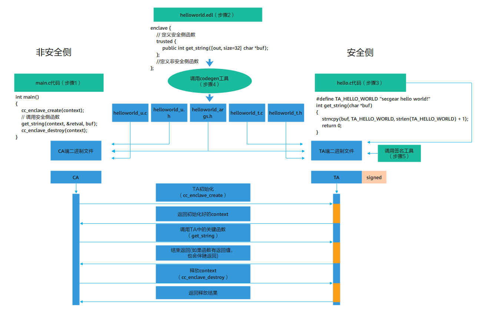

# secGear 开发指南

这里给出使用 secGear 开发一个 C 语言程序 helloworld 的例子，方便用户理解使用 secGear 开发应用程序。

## 下载样例

```bash
git clone https://gitee.com/openeuler/secGear.git
```

## 目录结构说明

```shell
cd examples/helloworld

#目录结构如下
├── helloworld
│   ├── CMakeLists.txt
│   ├── enclave
│   │   ├── CMakeLists.txt
│   │   ├── Enclave.config.xml
│   │   ├── Enclave.lds
│   │   ├── hello.c
│   │   ├── manifest.txt
│   │   └── config_cloud.ini
│   ├── helloworld.edl
│   └── host
│       ├── CMakeLists.txt
│       └── main.c
```

代码主体分为三块：

- 非安全侧程序（main.c）
- 非安全侧与安全侧调用接口头文件（helloworld.edl）
- 安全侧程序（hello.c）

## 准备工作

除以上三部分主体代码外，还有编译工程文件（CMakeLists.txt）、开发者证书（SGX的Enclave.config.xml/Enclave.lds，鲲鹏的manifest.txt/config_cloud.ini）。

> 说明:
>
> - 鲲鹏开发者证书需要向华为业务负责人[申请开发者证书](https://gitee.com/link?target=https%3A%2F%2Fwww.hikunpeng.com%2Fdocument%2Fdetail%2Fzh%2Fkunpengcctrustzone%2Ffg-tz%2Fkunpengtrustzone_04_0009.html)。
> - SGX以Debug模式调试，暂时不用申请。如需正式商用并且用intel的远程证明服务，需要向Intel申请License。

申请成功后会得到开发者证书相关文件，需要放置到代码目录相应位置。

## 开发步骤

基于secGear做机密计算应用拆分改造，类似于独立功能模块提取，识别敏感数据处理逻辑，提取成独立的lib库，部署在可信执行环境中，对非安全侧提供的接口定义在EDL文件中。

开发步骤如下图所示。

1. 开发非安全侧main函数及接口，管理enclave并调用安全侧函数。
2. 开发EDL文件（类似C语言头文件定义非安全侧与安全侧交互接口）。
3. 开发安全侧接口实现。
4. 调用代码生成工具，根据EDL自动生成非安全侧与安全侧交互源码，并分别编译到非安全侧与安全侧二进制文件中，非安全侧逻辑直接调用安全侧对应的接口即可，无需关心自动的生成的交互代码，降低开发成本。
5. 调用签名工具对安全侧二进制签名，实现安全侧程序可信启动。



## 编译运行

### ARM环境

```shell
// clone secGear repository
git clone https://gitee.com/openeuler/secGear.git

// build sdk and examples
cd secGear/sdk
source environment
mkdir debug && cd debug && cmake -DENCLAVE=GP .. && make && sudo make install

// run helloworld
/vendor/bin/secgear_helloworld
```

### x86环境

```shell
// clone secGear repository
git clone https://gitee.com/openeuler/secGear.git

// build sdk and examples
cd secGear/sdk
source /opt/intel/sgxsdk/environment && source environment
mkdir debug && cd debug && cmake .. && make && sudo make install

// run helloworld
./examples/helloworld/host/secgear_helloworld
```
