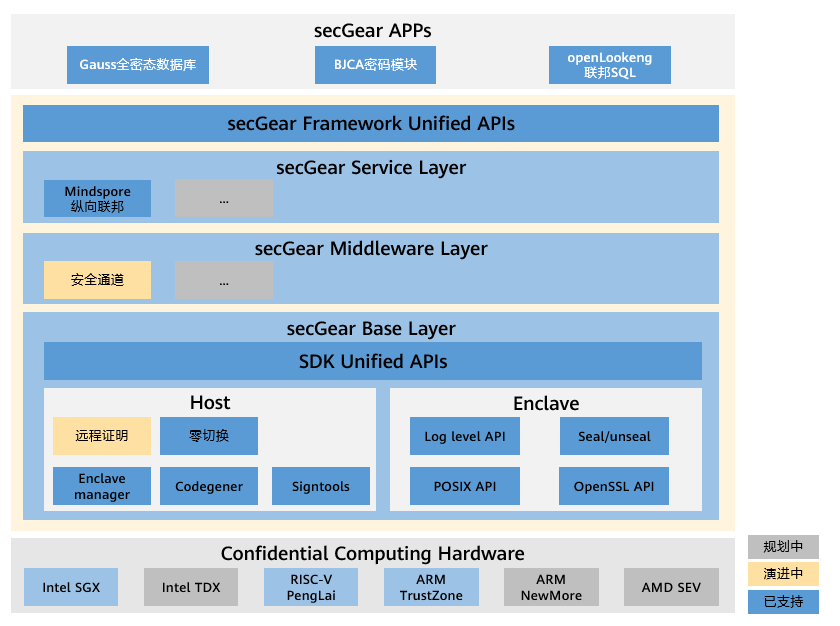

# 认识secGear

## 概述

随着云计算的快速发展，越来越多的企业把计算业务部署到云上，面对第三方云基础设施，云上用户数据安全面临着巨大的挑战。机密计算是一种基于硬件可信执行环境的隐私保护技术，旨在依赖最底层硬件，构建最小信任依赖，将操作系统、Hypervisor、基础设施、系统管理员、服务提供商等都从信任实体列表中删除，视为未经授权的实体，从而减少潜在的风险，保护可信执行环境中数据的机密性、完整性。然而随着机密计算技术的兴起，业界机密计算技术种类繁多（如主流的Intel SGX、ARM Trustzone、RISC-V keystone等），各技术SDK也千差万别，给开发者带来较大的开发维护成本，长远考虑，还造成了机密计算应用生态隔离。为方便开发者快速构建保护云上数据安全的机密计算解决方案，openEuler推出机密计算统一开发框架secGear。

## 架构介绍



secGear机密计算统一开发框架技术架构如图所示，主要包括三层，共同组成openEuler机密计算软件生态底座。

- Base Layer：机密计算SDK统一层，屏蔽TEE及SDK差异，实现不同架构共源码。
- Middleware Layer：通用组件层，机密计算软件货架，无需从头造轮子，帮助用户快速构建机密计算解决方案。
- Server Layer：机密计算服务层，提供典型场景机密计算解决方案。

## 关键特性

### 零切换

#### 用户痛点

传统应用做机密计算拆分改造后，REE侧逻辑存在频繁调用TEE侧逻辑时或REE与TEE存在频繁大块数据交互时。由于REE与TEE之间的每次调用，都需要经过REE用户态 、REE内核态、驱动、TEE内核态、TEE用户态之间的上下文切换，调用传递的大块数据也要经过多次拷贝，并且驱动底层数据块大小限制等因素，频繁的REE与TEE交互性能直线下降，严重影响机密计算应用的落地。

#### 解决方案

[零切换](https://gitee.com/openeuler/secGear#switchless%E7%89%B9%E6%80%A7)是一种通过共享内存减少REE与TEE上下文切换及数据拷贝次数，优化REE与TEE交互性能的技术。

#### 使用方法

1.创建enclave时启用零切换

    零切换配置项及说明如下。

  ```c
typedef struct {
    uint32_t num_uworkers;
    uint32_t num_tworkers;
    uint32_t switchless_calls_pool_size;
    uint32_t retries_before_fallback;
    uint32_t retries_before_sleep;
    uint32_t parameter_num;
    uint32_t workers_policy;
    uint32_t rollback_to_common;
    cpu_set_t num_cores;
} cc_sl_config_t;
  ```

| 配置项                     | 说明                                                         |
| -------------------------- | ------------------------------------------------------------ |
| num_uworkers               | 非安全侧代理工作线程数，用于执行switchless OCALL，当前该字段仅在SGX平台生效，ARM平台可以配置，但是因ARM平台暂不支持OCALL，所以配置后不会生效。 <br />规格： <br />ARM：最大值：512；最小值：1；缺省值：8（配置为0时）<br />SGX：最大值：4294967295；最小值：1 |
| num_tworkers               | 安全侧代理工作线程数，用于执行switchless ECALL。 <br />规格： <br />ARM：最大值：512；最小值：1；缺省值：8（配置为0时） <br />SGX：最大值：4294967295；最小值：1 |
| switchless_calls_pool_size | switchless调用任务池的大小，实际可容纳switchless_calls_pool_size * 64个switchless调用任务（例：switchless_calls_pool_size=1，可容纳64个switchless调用任务）。 <br />规格： <br />ARM：最大值：8；最小值：1；缺省值：1（配置为0时）<br />SGX：最大值：8；最小值：1；缺省值：1（配置为0时） |
| retries_before_fallback    | 执行retries_before_fallback次汇编pause指令后，若switchless调用仍没有被另一侧的代理工作线程执行，就回退到switch调用模式，该字段仅在SGX平台生效。 <br />规格：SGX：最大值：4294967295；最小值：1；缺省值：20000（配置为0时） |
| retries_before_sleep       | 执行retries_before_sleep次汇编pause指令后，若代理工作线程一直没有等到有任务来，则进入休眠状态，该字段仅在SGX平台生效。 <br />规格： SGX：最大值：4294967295；最小值：1；缺省值：20000（配置为0时） |
| parameter_num              | switchless函数支持的最大参数个数，该字段仅在ARM平台生效。<br />规格： ARM：最大值：16；最小值：0 |
| workers_policy             | switchless代理线程运行模式，该字段仅在ARM平台生效。 <br />规格： ARM： WORKERS_POLICY_BUSY：代理线程一直占用CPU资源，无论是否有任务需要处理，适用于对性能要求极高且系统软硬件资源丰富的场景； WORKERS_POLICY_WAKEUP：代理线程仅在有任务时被唤醒，处理完任务后进入休眠，等待再次被新任务唤醒 |
| rollback_to_common         | 异步switchless调用失败时是否回退到普通调用，该字段仅在ARM平台生效。 <br />规格： ARM：0：否，失败时仅返回相应错误码；其他：是，失败时回退到普通调用，此时返回普通调用的返回值 |
| num_cores                  | 用于设置安全侧线程绑核 <br />规格： 最大值为当前环境CPU核数 |

2.定义EDL文件中接口时添加零切换标识transition_using_threads

  ```ocaml
  enclave {
      include "secgear_urts.h"
      from "secgear_tstdc.edl" import *;
      from "secgear_tswitchless.edl" import *;
      trusted {
          public int get_string([out, size=32]char *buf);
          public int get_string_switchless([out, size=32]char *buf) transition_using_threads;
      };
  };
  ```

### 安全传输

#### 用户痛点

数据拥有者在请求云上机密计算服务时，需要把待处理数据上传到云上TEE环境中处理，在传输过程中存在数据泄露风险。针对不同网络访问能力的TEE环境，可采用如下解决方案。

#### 解决方案1：安全通道

该方案针对TEE没有网络的场景，用户数据需要经过网络先传输到REE，由REE再传入TEE中。该方案结合机密计算远程证明，实现数据拥有者与云上TEE之间安全的密钥协商技术，协商出仅数据拥有者与云上TEE拥有的sessionkey，再通过sessionkey加密用户数据，网络传输的是sessionkey加密后的数据，REE接收到密文数据，再传入TEE中解密、处理，该方案称为安全通道。

#### 使用方法

安全通道以lib库方式提供，分为客户端、服务端host、服务端enclave三部分，分别由业务程序的客户端、服务端CA、服务端TA调用。

| 模块         | 头文件                      | 库文件                   | 依赖      |
|------------|--------------------------|-----------------------|---------|
| 客户端        | secure_channel_client.h  | libcsecure_channel.so | openssl |
| 服务端host    | secure_channel_host.h    | libusecure_channel.so | openssl |
| 服务端enclave | secure_channel_enclave.h | libtsecure_channel.so | TEE及TEE软件栈     |

##### 接口列表

| 接口名                                                                                                                                          | 所属头文件、库                   | 功能           | 备注 |
|----------------------------------------------------------------------------------------------------------------------------------------------|-----------------------|--------------|----|
| cc_sec_chl_client_init                                                 | secure_channel_client.h libcsecure_channel.so | 安全通道客户端初始化   | 调用前需初始化参数ctx中网络连接和消息发送钩子函数   |
| cc_sec_chl_client_fini                                                                                         | secure_channel_client.h libcsecure_channel.so | 安全通道客户端销毁    | 通知服务端销毁本客户端的信息，销毁本地安全通道信息   |
| cc_sec_chl_client_callback                                              | secure_channel_client.h libcsecure_channel.so | 安全通道协商消息处理函数 | 处理安全通道协商过程中，服务端发送给客户端的消息。在客户端消息接收处调用   |
| cc_sec_chl_client_encrypt | secure_channel_client.h libcsecure_channel.so | 安全通道客户端的加密接口     |  无  |
| cc_sec_chl_client_decrypt | secure_channel_client.h libcsecure_channel.so | 安全通道客户端的解密接口     |  无   |
|  int (*cc_conn_opt_funcptr_t)(void*conn, void *buf, size_t count);                                                                                                                                            |    secure_channel.h                    |    消息发送钩子函数原型          | 由用户客户端和服务端实现，实现中指定安全通道协商消息类型，负责发送安全通道协商消息到对端   |
|  cc_sec_chl_svr_init                                                                                                                                            |  secure_channel_host.h  libusecure_channel.so                    |  安全通道服务端初始化            | 调用前需初始化ctx中enclave_ctx   |
|  cc_sec_chl_svr_fini                                                                                                                                            |   secure_channel_host.h  libusecure_channel.so                    |  安全通道服务端销毁            |  销毁安全通道服务端以及所有客户端信息  |
|  cc_sec_chl_svr_callback                                                                                                                                            |  secure_channel_host.h  libusecure_channel.so                     |  安全通道协商消息处理函数            | 处理安全通道协商过程中，客户端发送给服务端的消息。在服务端消息接收处调用，调用前需初始化与客户端的网络连接和发送消息函数，详见[样例](https://gitee.com/openeuler/secGear/blob/master/examples/secure_channel/host/server.c#:~:text=conn_ctx.conn_kit.send)。   |
| cc_sec_chl_enclave_encrypt                                                                                                                                             |    secure_channel_enclave.h libtsecure_channel.so                   | 安全通道enclave中的加密接口             | 无   |
|   cc_sec_chl_enclave_decrypt                                                                                                                                           |   secure_channel_enclave.h libtsecure_channel.so                    | 安全通道enclave中的解密接口             |  无 |

##### 注意事项

安全通道仅封装密钥协商过程、加解密接口，不建立网络连接，协商过程复用业务的网络连接。其中客户端和服务端的网络连接由业务建立和维护，在安全通道客户端和服务端初始化时传入消息发送钩子函数和网络连接指针。
详见[安全通道样例](https://gitee.com/openeuler/secGear/tree/master/examples/secure_channel)。

#### 解决方案2：RA_TLS

该方案针对TEE具备网络通信能力的场景，例如：机密虚机/机密容器，具体过程：TA使用自签发证书，证书中包含远程证明材料，在TLS握手过程中使用远程证明服务，对证书中包含的证明材料校验，验证失败则结束握手，否则正常执行握手动作，该方案称为RA_TLS。
该方案较方案1取消中间数据接收者，同时增加远程证明过程，既实现对TEE环境的校验，又能实现数据加密传输到TA。

#### 使用方法

RA_TLS以lib库形式提供，使用样例参考[RA_TLS样例](https://gitee.com/openeuler/secGear/tree/master/examples/ra_tls)

| 头文件     | 库文件       | 依赖                 |
|-----------|--------------|---------------------|
| ra_tls.h  | libra_tls.so | cjson，curl，TLS库(例如openssl)  |

##### 接口列表

| 接口名                       | 所属头文件            | 功能                   | 备注 |
|-----------------------------|-----------------------|------------------------|---- |
|ra_tls_generate_certificate  |ra_tls.h               |TA生成自签名证书         |-    |
|ra_tls_set_addr              |ra_tls.h               |设置远程证明Agent地址    |-    |
|ra_tls_cert_extension_expired|ra_tls.h               |护照模式下检查证书是否过期|仅用于护照模式|
|ra_tls_verify_callback       |ra_tls.h               |用于握手过程中回调校验证书|-    |

### 远程证明

#### 用户痛点

随着机密计算技术的发展，逐渐形成几大主流技术（如Arm Trustzone/CCA、Intel SGX/TDX、擎天Enclave、海光CSV等），产品解决方案中可能存在多种机密计算硬件，甚至不同TEE之间的协同，其中远程证明是任何一种机密计算技术信任链的重要一环，每种技术的远程证明报告格式及验证流程各有差异，用户对接不同的TEE，需要集成不同TEE证明报告的验证流程，增加了用户的集成负担，并且不利于扩展新的TEE类型。

#### 解决方案

secGear远程证明统一框架是机密计算远程证明相关的关键组件，屏蔽不同TEE远程证明差异，提供Attestation Agent和Attestation Service两个组件，Agent供用户集成获取证明报告，对接证明服务；Service可独立部署，支持iTrustee、virtCCA远程证明报告的验证。

#### 功能描述

远程证明统一框架聚焦机密计算相关功能，部署服务时需要的服务运维等相关能力由服务部署第三方提供。远程证明统一框架的关键技术如下：

- 报告校验插件框架：支持运行时兼容iTrustee、vritCCA、CCA等不同TEE平台证明报告检验，支持扩展新的TEE报告检验插件。
- 证书基线管理：支持对不同TEE类型的TCB/TA基线值管理及公钥证书管理，集中部署到服务端，对用户透明。
- 策略管理：提供默认策略（易用）、用户定制策略（灵活）。
- 身份令牌：支持对不同TEE签发身份令牌，由第三方信任背书，实现不同TEE类型相互认证。
- 证明代理：支持对接证明服务/点对点互证，兼容TEE报告获取，身份令牌验证等，易集成，使用户聚焦业务。

根据使用场景，支持点对点验证和证明服务验证两种模式。

证明服务验证流程如下：

1.用户（普通节点或TEE）对TEE平台发起挑战。

2.TEE平台通过证明代理获取TEE证明报告，并返回给用户。

3.用户端证明代理将报告转发到远程证明服务。

4.远程证明服务完成报告校验，返回由第三方信任背书的统一格式身份令牌。

5.证明代理验证身份令牌，并解析得到证明报告校验结果。

6.得到通过的校验结果后，建立安全连接。

点对点验证流程(无证明服务)如下：

1.用户向TEE平台发起挑战，TEE平台返回证明报告给用户。

2.用户使用本地点对点TEE校验插件完成报告验证。

> [!NOTE]说明
>
> 点对点验证和远程证明服务验证时的证明代理不同，在编译时可通过编译选项，决定编译有证明服务和点对点模式的证明代理。
>
#### 应用场景

在金融、AI等场景下，基于机密计算保护运行中的隐私数据安全时，远程证明是校验机密计算环境及应用合法性的技术手段，远程证明统一框架提供了易集成、易部署的组件，帮助用户快速使能机密计算远程证明能力。

### 密钥托管

#### 用户痛点

机密容器作为云原生与机密计算技术融合的创新型安全方案，通过加密镜像全生命周期防护，有效应对合规性审查、供应链攻击防御及知识产权防泄漏等核心安全诉求。该方案依赖密钥托管为基础，重点构建覆盖密钥安全存储、动态细粒度授权、跨环境协同分发的管理体系，并借助零信任策略与自动化审计能力，在确保数据机密性与操作可追溯性的同时，实现密钥治理复杂度与运维成本的最优平衡，为云原生环境提供“默认加密、按需解密”的一体化防护能力。

#### 解决方案

secGear的密钥托管方案通过可信硬件认证与动态策略控制构建多层防御体系，并基于远程证明框架实现密钥全生命周期保护。该方案通过远程证明协议验证TEE环境完整性，结合自签名公私钥证书算法，在确保密钥存储安全、传输抗截获、使用可追溯的同时，支持跨云协同与边缘安全场景，实现每秒万级密钥分发的业务吞吐。

#### 功能描述

针对密钥管理领域的安全性与可信验证需求，secGear框架整合远程证明技术构建分层密钥托管体系：

1. **证明服务**：通过构建集中式密钥托管服务，基于机密执行环境（TEE）远程证明机制实现对加密镜像密钥的安全存储与生命周期管理，并面向授权用户提供精细化策略配置接口；
2. **证明代理**：在机密计算节点内部署轻量级证明代理组件，提供本地restAPI接口。机密容器运行时通过调用证明代理接口完成机密执行环境的完整性验证，并与服务端建立动态会话实现密钥的安全传输。

#### 应用场景

secGear的密钥托管功能与Kuasar容器运行时形成完整的机密容器解决方案，适用于任何需要高度数据安全和隐私保护的场景，尤其是在金融、医疗、政府、云计算、物联网等领域。通过容器镜像加密和密钥托管功能，可以有效保护容器镜像的完整性，减少容器数据泄露风险，防止供应链攻击，提升用户对云原生厂商的信任程度。

## 缩略语

| 缩略语 | 英文全名                      | 中文解释         |
| ------ | ----------------------------- | ---------------- |
| REE    | Rich Execution Environment    | 富执行环境       |
| TEE    | Trusted Execution Environment | 可信执行环境     |
| EDL    | Enclave Description Language  | 安全应用描述语言 |
| TA     | Trusted Application           | 可信应用        |
| RA     | Remote Attestation            | 远程证明        |
| TLS    | Transport Layer Security      | 传输层安全      |
