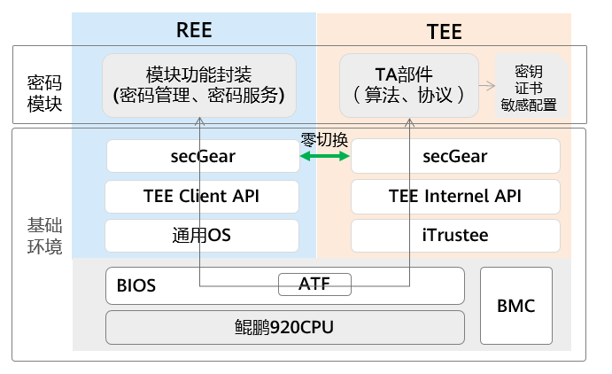
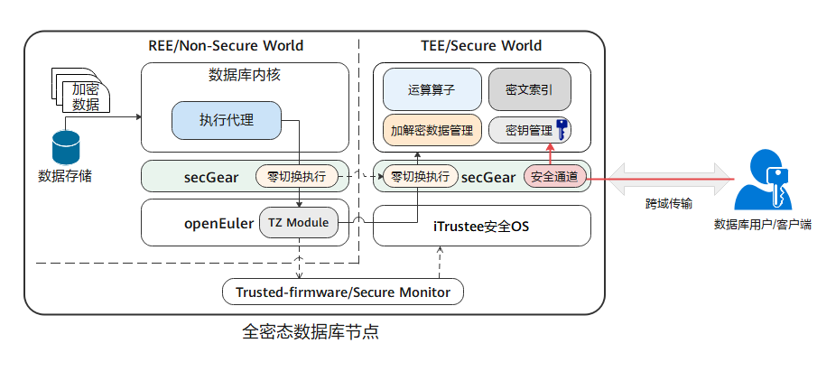
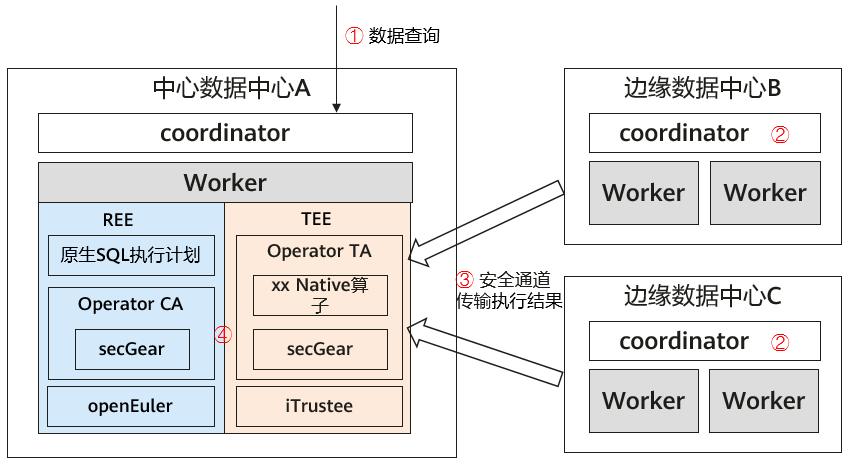
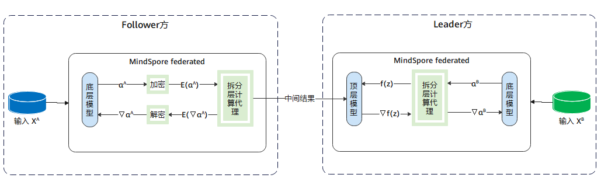
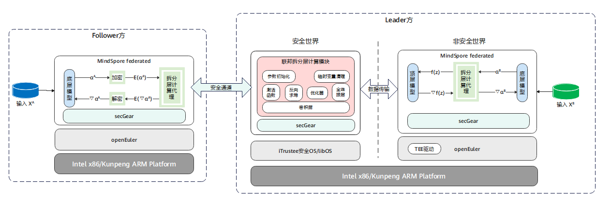

# 应用场景

本文通过举例介绍典型场景机密计算解决方案，帮助读者理解secGear的使用场景，进而结合自己的业务构建对应的机密计算解决方案。

## BJCA基于TEE的密码模块

在政策和业务的双驱动下，密码应用保障基础设施一直在向虚拟化演进，随着业务上云，密码服务支撑也需要构建全新的密码交付模式，实现密码、云服务与业务应用的融合，因此数字认证（BJCA）推出基于TEE的密码模块。数字认证既可以利用鲲鹏TEE环境构建合规的密码计算模块，支撑密码云服务平台，同时也可以基于鲲鹏主机构建“机密计算平台”，为云计算、隐私计算、边缘计算等各类场景提供“高速泛在、弹性部署、灵活调度”的密码服务支撑。基于鲲鹏处理器的内生式密码模块已经成为密码行业变革型的创新方案，并作为内生可信密码计算新起点。

### 现状

传统密码模块中算法协议以及处理的数据是隐私数据，密码模块上云存在安全风险。

### 解决方案

基于TEE的密码模块方案如图所示，其中密码模块基于secGear机密计算开发框架拆分成两部分：管理服务、算法协议。

- 管理服务：运行在REE侧，负责对外提供密码服务，转发请求到TEE中处理。
- 算法协议：运行在TEE侧，负责用户数据加/解密等处理。

由于密码服务可能存在高并发、大数据请求，此时REE与TEE存在频繁交互以及大数据拷贝，会导致性能直线下降，针对类似场景可使用secGear零切换特性优化，减少调用切换及数据拷贝次数，实现性能倍增。

## GaussDB基于TEE的全密态数据库

云数据库俨然已成为数据库业务未来重要的增长点，绝大多数的传统数据库服务厂商正在加速提供更优质的云数据库服务。然而云数据库所面临的风险相较于传统数据库更复杂多样，无论是应用程序漏洞、系统配置错误，还是恶意管理员都可能对数据安全与隐私保护造成巨大风险。

### 现状

云数据库的部署网络由“私有环境”向“开放环境”转变，系统运维管理角色被拆分为业务管理员和运维管理员。业务管理员拥有业务管理的权限，属于企业业务方，而运维管理员属于云服务提供商。数据库运维管理员虽然被定义成系统运维管理，其实际依旧享有对数据的完全使用权限，通过运维管理权限或提权来访问数据甚至篡改数据；再者，由于开放式的环境和网络边界的模糊化，用户数据在整个业务流程中被更充分的暴露给攻击者，无论是传输、存储、运维还是运行态，都有可能遭受来自攻击者的攻击。因此对于云数据库场景，如何解决第三方可信问题，如何更加可靠的保护数据安全相比传统数据库面临着更大挑战，其中数据安全、隐私不泄露是整个云数据库面临的首要安全挑战。

### 解决方案

面对上述挑战，基于TEE的GaussDB（openGauss）全密态数据库的设计思路是：用户自己持有数据加解密密钥，数据以密文形态存在于数据库服务侧的整个生命周期过程中，并在数据库服务端TEE内完成查询运算。

基于TEE的全密态数据库解决方案如图所示，全密态数据库的特点如下：

1. 数据文件以密文形式存储，不存储密钥明文信息。
2. DB数据密钥保存在客户端。
3. 客户端发起查询请求时，在服务端REE侧执行密态SQL语法得到相关密文记录，送入TEE中。
4. 客户端通过secGear安全通道将DB数据密钥加密传输到服务端TEE中，在TEE中解密得到DB数据密钥，用DB数据密钥将密文记录解密得到明文记录，执行SQL语句，得到查询结果，再将DB数据密钥加密后的查询结果发送给客户端。

其中步骤3在数据库高并发请求场景下，会频繁触发REE-TEE之间调用以及大量的数据传输，导致性能直线下降，通过secGear零切换特性优化，减少调用切换及数据拷贝次数，实现性能倍增。

## openLooKeng基于TEE的联邦SQL

openLooKeng联邦SQL是跨数据中心查询的一种，典型场景如下，有三个数据中心：中心数据中心A，边缘数据中心B和边缘数据中心C。openLooKeng集群部署在三个数据中心中，当数据中心A收到一次跨域查询请求时，会下发执行计划到各数据中心，在边缘数据中心B和C的openLookeng集群完成计算后，通过网络将结果传递给数据中心A中的openLookeng集群完成聚合计算。

### 现状

在以上方案中，计算结果在不同数据中心的openLookeng集群之间传递，避免了网络带宽不足，一定程度上解决了跨域查询问题。但是计算结果是从原始数据计算得到的，可能带有敏感信息，导致数据出域存在一定安全和合规风险。怎么保护聚合计算过程中边缘数据中心的计算结果，在中心数据中心实现“可用而不可见”呢？

### 解决方案

其基本思路是：数据中心A中，openLookeng集群将聚合计算逻辑及算子拆分出独立的模块，部署到鲲鹏TEE环境上中；其他边缘数据中心的计算结果通过安全通道传输到数据中心A的TEE中；所有数据最终在TEE中完成聚合计算，从而保护聚合计算过程中边缘数据中心的计算结果不会被数据中心A上REE侧特权程序或恶意程序获取、篡改。

基于TEE的联邦SQL解决方案如图所示，具体查询流程如下：

1. 用户在数据中心A下发跨域查询请求，openLooKeng的Coordinator根据查询SQL及数据源分布，拆解下发执行计划到本地工作节点以及边缘数据中心的coordinator，边缘数据中心的coordinator再下发到本地工作节点。
2. 各工作节点执行计划，得到本地计算结果。
3. 边缘数据中心通过secGear安全通道将本地计算结果加密后经网络传到数据中心A的REE侧，并中转到TEE中，在TEE中解密计算结果。
4. 数据中心A在TEE中对数据中心A、B、C的计算结果执行聚合计算，得到最终执行结果，并返回给用户。

其中步骤4，在存在大量查询请求时，会频繁触发REE-TEE调用，并且有大量数据的拷贝，导致性能直线下降。通过secGear零切换特性优化，减少调用切换及数据拷贝次数，实现性能倍增。

## MindSpore基于TEE的纵向联邦特征保护

纵向联邦学习是联邦学习的一个重要分支，当不同的参与方拥有来自相同一批用户但属性不同的数据时，可以利用纵向联邦学习进行协同训练。

### 现状

传统方案如图所示，具体数据处理流程如下。

1. 拥有属性的参与方（Follower方）都会持有一个底层网络，参与方属性输入底层网络得到中间结果，再将中间结果发送给拥有标签的参与方（Leader方）。
2. Leader方使用各参与方的中间结果和标签来训练顶层网络，再将计算得到的梯度回传给各参与方来训练底层网络。

此方案避免了Follower方直接上传自己的原始数据，保护原始数据不出域，一定程度上保护了隐私安全。然而，攻击者还是有可能从上传的中间结果反推出用户信息，导致存在隐私泄露风险。因此我们需要对训练时出域的中间结果和梯度提供更强的隐私保护方案，来满足安全合规要求。

### 解决方案

借鉴之前三个场景的安全风险及解决方案可以发现，想要达到中间结果出域后的“可用不可见”，正是机密计算的“拿手好戏”。

基于TEE的纵向联邦特征保护方案如图所示，具体数据处理流程如下。

1. Follower方的中间结果通过secGear的安全通道加密后传输到Leader方，Leader方非安全世界接收到加密的中间结果后中转到安全世界，在安全世界通过安全通道接口解密。
2. 在安全世界中将中间结果输入到联邦拆分层计算模块，完成结果计算。

以上过程中Follower方的中间结果明文只存在于安全世界内存中，对Leader方来说就是黑盒子，无法访问。
