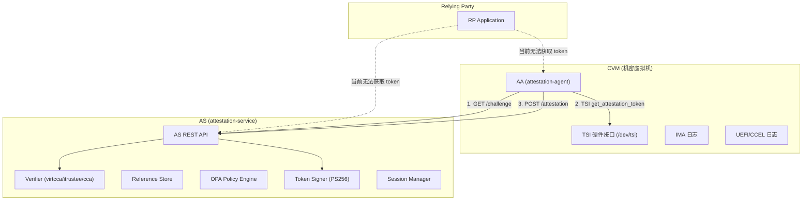
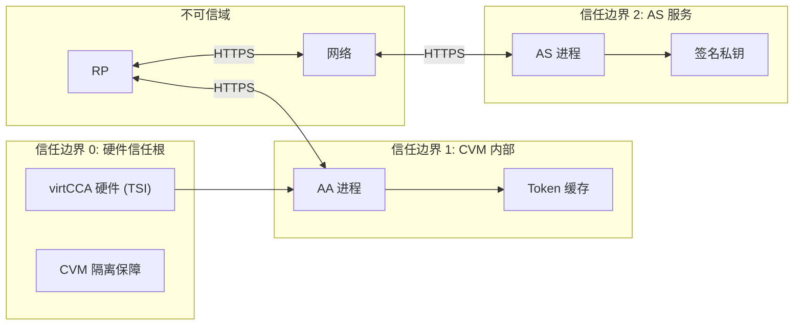
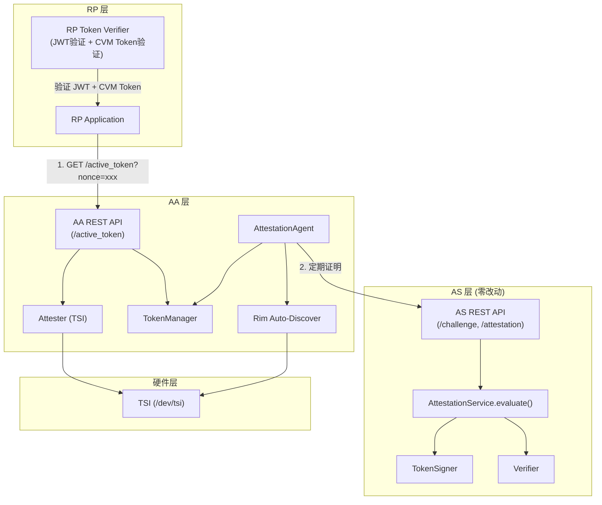
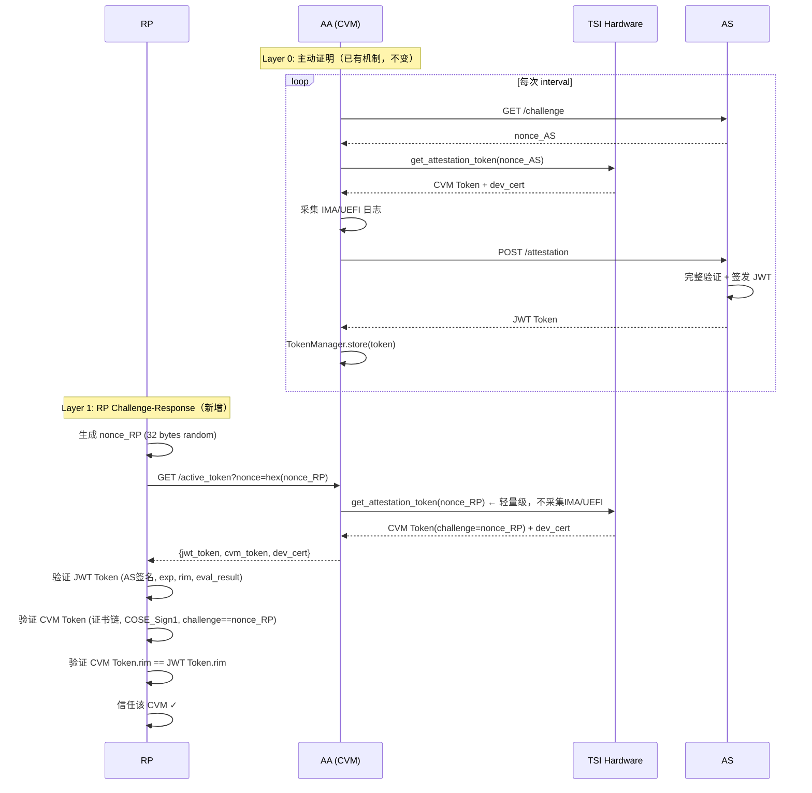
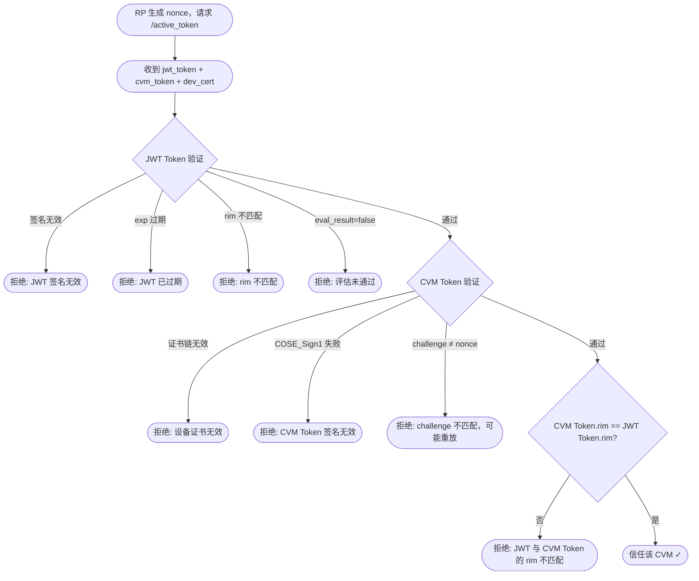
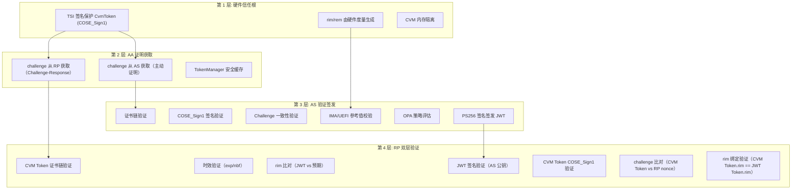

# virtCCA 主动证明（Active Attestation）方案设计

## 0. 需求描述与分析

### 问题背景与原始痛点

virtCCA 远程证明系统当前已实现基础的"被动证明"（Passive Attestation）流程：Relying Party（RP）发起挑战 -> AA 获取 evidence -> AS 验证签发 token。同时，AA 侧已实现了主动证明的定时刷新机制，能够周期性地从 AS 获取 challenge、调用 TSI 硬件接口获取 evidence、提交 AS 验证并缓存 JWT token。

然而，当前主动证明存在以下关键缺口，使其无法真正服务于 RP：

| 编号 | 痛点 | 影响 |
|------|------|------|
| P1 | RP 无法获取 token：`/current_token` API 仅返回状态元信息，不返回原始 JWT token | RP 无法完成端到端验证闭环 |
| P2 | Token 与 CVM 实例无绑定：当前 JWT token 的 `tcb_status` 包含 `vcca.cvm.rim` 等 image 级别字段，但 RP 无法确认 token 来自哪个 CVM 实例 | 同镜像 CVM 可互相仿冒 |
| P3 | RP 缺少验证参考实现：当前 RP 验证 token 的方式是通过 OEAS `/oeas-api/cert` 下载 AS 公钥证书后本地验证 JWT，但缺少完整的验证参考实现 | RP 集成成本高 |
| P4 | AA 配置中 uuid 与 rim 的手动对应：当前需要运维人员手动将 uuid 配置为 rim hex 值 | 部署复杂度高 |

### 核心诉求提取

1. **RP 可获取 CVM 的有效证明 token**：提供 API 让 RP 获取指定 CVM 的 JWT token
2. **Token 与实时 CVM Token 响应绑定**：RP 可验证 token 与目标 AA 返回的 CVM Token 具有相同 rim，并且 CVM Token 绑定 RP nonce，防止预获取 token 仿冒
3. **CVM 标识自动发现**：AA 启动时自动从硬件获取 rim，无需手动配置 uuid-rim 映射
4. **端到端安全性**：防止 token 重放、仿冒、中间人攻击等安全威胁

### 部署约束与范围声明

本方案当前版本聚焦于**跑通 virtCCA 主动证明的端到端流程**，以下为明确的部署约束和范围边界：

| 约束项 | 说明 | 后续演进 |
|--------|------|----------|
| rim 为 image 级别标识 | 同镜像多 CVM 实例共享 rim。本方案适用于**单实例部署**或**同镜像 CVM 可互换信任**的场景 | 后续扩展 CVM 实例级证明时引入 instance 级标识 |
| AS 无 API 变更 | 不新增 AS 对外 REST API，保持与 trustzone、cca 等平台实现一致。Phase 3 增加 jti 字段时需小幅修改 AS TokenSigner | Phase 3: AS TokenSigner 增加 jti 生成 |
| AS 单实例部署 | 不支持多 AS 实例间的缓存同步 | 后续可引入 Redis 等分布式缓存 |
| CVM 间网络隔离 | Phase 1 依赖 VPC 安全组/CVM 防火墙限制 CVM 间互访 AA 端口，防止实时转发攻击 | Phase 3 增加 AA 端认证 |
| Token 重放防护 | Phase 1 依赖 JWT 短有效期（300 秒）防重放；Phase 3 增加 jti 字段实现 RP 端去重 | Phase 3: Claims 增加 jti + RP 去重缓存 |

---

## 1. 既存机制与代码实现分析

### 1.1 现有系统边界与运行机制

#### 1.1.1 整体架构



#### 1.1.2 AA 主动证明现有流程

AA 的主动证明核心实现在 [lib.rs](file:///Users/chengkun/Projects/secGear/service/attestation/attestation-agent/agent/src/lib.rs) 中：

- **启动入口**：[AttestationAgent::new_with_interval()](file:///Users/chengkun/Projects/secGear/service/attestation/attestation-agent/agent/src/lib.rs#L199) 根据 `enable_active_attestation` 开关为每个 `AppConfig` 创建 tokio 异步任务
- **定时循环**：[start_active_attestation()](file:///Users/chengkun/Projects/secGear/service/attestation/attestation-agent/agent/src/lib.rs#L245) 实现无限循环，计算刷新延迟 -> 等待 -> 双重检查 -> 执行刷新
- **刷新逻辑**：[perform_token_refresh()](file:///Users/chengkun/Projects/secGear/service/attestation/attestation-agent/agent/src/lib.rs#L290) 调用 `perform_active_attestation()` 获取新 token，存入 `AppConfig.token_manager`
- **证明执行**：[perform_active_attestation()](file:///Users/chengkun/Projects/secGear/service/attestation/attestation-agent/agent/src/lib.rs#L334) 执行 get_challenge_from_as -> get_evidence -> verify_evidence_by_as 三步流程
- **Token 管理**：[TokenManager](file:///Users/chengkun/Projects/secGear/service/attestation/attestation-types/src/config.rs#L24) 管理 token 的存储、过期检测、TTL 计算、刷新策略

#### 1.1.3 AA REST API 现状

AA 当前暴露的 API 端点（[main.rs](file:///Users/chengkun/Projects/secGear/service/attestation/attestation-agent/agent/src/main.rs#L96)）：

| 端点 | 方法 | 功能 |
|------|------|------|
| `/challenge` | GET | 获取 challenge |
| `/evidence` | GET | 获取 evidence |
| `/evidence` | POST | 验证 evidence |
| `/token` | GET | 获取 token（被动证明流程） |
| `/token` | POST | 验证 token |
| `/resource` | GET | 获取资源 |
| `/current_token` | GET | 查询 token 状态元信息 |

关键问题：[get_current_token()](file:///Users/chengkun/Projects/secGear/service/attestation/attestation-agent/agent/src/restapi/mod.rs#L242) 只返回元信息，不返回 JWT token 本身。

#### 1.1.4 AS 端验证与签发流程

AS 的核心验证逻辑在 [AttestationService::evaluate()](file:///Users/chengkun/Projects/secGear/service/attestation/attestation-service/service/src/lib.rs#L127) 中：

1. **Verifier 验证**：调用 [Verifier::verify_evidence()](file:///Users/chengkun/Projects/secGear/service/attestation/attestation-service/verifier/src/lib.rs#L45)，根据 tee 类型分发到具体验证器
2. **virtcca 验证链**：[VirtCCAVerifier::evaluate()](file:///Users/chengkun/Projects/secGear/service/attestation/attestation-service/verifier/src/virtcca/mod.rs#L55) -> Evidence::verify() 执行：
   - 设备证书链验证（dev_cert -> sub CA -> root CA）
   - CVM Token 签名验证（COSE_Sign1 + RSA 公钥）
   - Challenge 验证
   - IMA 校验（PCR 绑定 + 白名单，用 rim 查找基线）
   - UEFI 校验（RTMR 重放 + 白名单）
3. **参考值查询**：[ReferenceOps::query()](file:///Users/chengkun/Projects/secGear/service/attestation/attestation-service/reference/src/reference/mod.rs#L142) 根据 claims payload 中的键查询参考值
4. **OPA 策略评估**：[OPA::evaluate()](file:///Users/chengkun/Projects/secGear/service/attestation/attestation-service/policy/src/opa/mod.rs#L36) 使用 regorus 引擎评估 rego 策略
5. **签发 JWT**：[TokenSigner::sign()](file:///Users/chengkun/Projects/secGear/service/attestation/attestation-service/token/src/lib.rs#L95) 使用 PS256 算法签发

#### 1.1.5 当前 Token 验证机制

| 组件 | 验证接口 | 访问方式 | 验证内容 |
|------|----------|----------|----------|
| AA | `POST /token` | 仅 CVM 内网可达 | JWT 签名 + iss + exp |
| AS | `token::verify()` 内部函数 | 无 REST API 暴露 | JWT 签名 + exp |
| OEAS | `GET /oeas-api/cert` | 对外可达 | 仅提供 AS 公钥证书下载 |

**关键发现**：AS 未暴露 Token 验证 REST API。当前 RP 验证方式是通过 OEAS 下载 AS 公钥证书后本地验证 JWT。

### 1.2 核心代码实现链路剖析

#### 1.2.1 JWT Token 结构

当前 JWT Claims 结构定义在 [Claims](file:///Users/chengkun/Projects/secGear/service/attestation/attestation-types/src/lib.rs#L139)：

```rust
pub struct Claims {
    pub iss: String,           // "oeas"
    pub iat: usize,            // 签发时间
    pub nbf: usize,            // 生效时间
    pub exp: usize,            // 过期时间
    pub evaluation_reports: EvlResult,
    pub tee: String,           // "virtcca"
    pub tcb_status: Value,     // 包含 vcca.cvm.rim 等
}
```

#### 1.2.2 rim 在系统中的使用方式

| 使用位置 | 代码引用 | 用途 |
|----------|----------|------|
| IMA 基线查找 | [virtcca.rs:148](file:///Users/chengkun/Projects/secGear/service/attestation/attestation-service/verifier/src/ima/virtcca.rs#L148) | `app_id = hex(rim)` 作为 IMA 白名单查找键 |
| IMA 参考值注册 | [reference/mod.rs:124](file:///Users/chengkun/Projects/secGear/service/attestation/attestation-service/reference/src/reference/mod.rs#L124) | `virtcca_ima_{rim_hex}` 前缀 |
| OPA 策略评估 | [default_vcca.rego](file:///Users/chengkun/Projects/secGear/service/attestation/attestation-service/policy/src/opa/default_vcca.rego#L5) | `expect_keys := ["vcca.cvm.rim"]` |
| Token tcb_status | [virtcca/mod.rs:198](file:///Users/chengkun/Projects/secGear/service/attestation/attestation-service/verifier/src/virtcca/mod.rs#L198) | `"vcca.cvm.rim": hex::encode(rim)` |

#### 1.2.3 TSI 接口分析

TSI 是 virtCCA 的硬件证明接口，通过 FFI 调用 `libvccaattestation.so`：

```c
// virtcca.rs:91-97 - FFI 接口
tsi_new_ctx() -> *mut c_void
get_attestation_token(ctx, challenge, challenge_len, token, token_len) -> c_int
get_dev_cert(ctx, dev_cert, dev_cert_len) -> c_int
tsi_free_ctx(ctx)
```

**关键特性**：
- `get_attestation_token` 是**纯本地调用**，不涉及网络，延迟约 10ms
- challenge 长度支持 1~64 字节
- 返回 CBOR Tag 399 编码的 CVM Token（含 COSE_Sign1 签名）
- CVM Token 中包含实例级字段：`pub_key`（550B RSA 公钥，每台 CVM 实例唯一）、`rem[0..3]`（运行时度量寄存器）

#### 1.2.4 被动证明流程中 `get_attestation_token` 的使用

```
调用方(外部RP/App)
  │
  │  GET /token?challenge=<base64_url>&uuid=<uuid>&ima=<bool>
  ▼
AA: get_token()                                   [lib.rs:144]
  │  ① get_evidence(EvidenceRequest{challenge, uuid, ima})
  ▼
AA: get_evidence()                                [lib.rs:103]
  ▼
VirtccaAttester: tee_get_evidence()               [attester/virtcca/mod.rs:36]
  ▼
virtcca_get_token(user_data)                      [attester/virtcca/mod.rs:49]
  │  ② base64_url::decode(&user_data.challenge) → challenge_bytes
  │  ③ TSI: get_attestation_token(ctx, challenge_bytes, ...) → CVM Token
  │  ④ TSI: get_dev_cert(ctx, ...) → dev_cert
  │  ⑤ 采集 IMA 日志 (如果 ima=true)
  │  ⑥ 采集 UEFI CCEL 日志
  │  ⑦ 组装 VirtccaEvidence {evidence, dev_cert, ima_log, uefi_log}
  ▼
AA: verify_evidence_by_as()                       [lib.rs:400]
  │  ⑧ POST /attestation {challenge, evidence, policy_id} → AS
  ▼
返回 JWT Token
```

### 1.3 仿冒攻击分析

#### 1.3.1 攻击场景：CVM A 仿冒 CVM B

```
前提：CVM A 和 CVM B 使用相同镜像，rim_A == rim_B == 0xABC

攻击步骤：
  ① CVM A 冒充 RP，向 CVM B 的 AA 请求 token：
     GET /active_token → B 的 AA 返回 {jwt_token_B}
  ② CVM A 保存 B 的 jwt_token_B
  ③ 合法 RP 向 CVM A 发起证明请求：
     GET /active_token → A 返回 B 的 jwt_token_B
  ④ RP 验证：签名✓ 时效✓ rim=0xABC✓ eval_result✓ → 信任
  ⑤ RP 与 A 建立安全通信 → A 仿冒成功！
```

**根因**：JWT Token 只绑定 rim（image 级别），不绑定 CVM 实例。RP 无法确认"给我 token 的实体就是 token 所证明的那个 CVM"。

#### 1.3.2 仿冒攻击变体：实时转发

```
前提：CVM A 能访问 CVM B 的 AA 端口

攻击步骤：
  ① RP → CVM A: GET /active_token?nonce=<RP_nonce>
  ② CVM A → CVM B: GET /active_token?nonce=<RP_nonce>  (实时转发)
  ③ B 的 AA 返回 B 的 token → A 转发给 RP
  ④ RP 验证全部通过 → 信任
  ⑤ RP 与 A 建立安全通信 → A 仿冒成功！
```

**即使使用 challenge-response**，如果 CVM A 能实时转发请求给 CVM B 的 AA，A 仍然可以仿冒。这是**网络层问题**，需要通过网络隔离来防御。

### 1.4 对新方案的兼容性与约束限制

1. **rim 作为 image 级别标识**：IMA 基线查找、参考值注册、OPA 策略评估均依赖 rim hex 作为键，不可更改
2. **AS 端 API 不可新增**：保持与 trustzone、cca 等平台实现一致
3. **被动证明流程不可变更**：现有的 `/challenge` -> `/evidence` -> `/attestation` 流程必须继续正常工作
4. **AA 部署在 CVM 内**：AA 的 API 默认仅在 CVM 内网可达

---

## 2. 设计目标与安全模型

### 2.1 方案目标

| 目标 | 描述 | 优先级 |
|------|------|--------|
| G1 | RP 可从目标 CVM 的 AA 获取 JWT token + CVM Token | P0 |
| G2 | RP 可通过 TSI Challenge-Response 验证 JWT token 与本次 CVM Token 响应的 rim 和 nonce 绑定 | P0 |
| G3 | AA 启动时自动发现 rim，无需手动配置 uuid-rim 映射 | P1 |
| G4 | 提供 RP 验证 token 的参考实现 | P1 |

### 2.2 安全模型与信任假设

#### 2.2.1 信任边界



#### 2.2.2 威胁模型

| 威胁 | 攻击方式 | 防御措施 |
|------|----------|----------|
| T1: Token 重放 | 攻击者截获合法 token，重复提交给 RP | JWT 短有效期（300 秒）；Phase 3 增加 jti 去重缓存 |
| T2: Token 伪造 | 攻击者构造虚假 token | AS PS256 签名 |
| T3: Token 篡改 | 攻击者修改 token 内容 | JWT 签名覆盖 |
| T4: 中间人攻击 | 攻击者拦截通信 | HTTPS + 证书校验 |
| T5: 同镜像 CVM 仿冒（预获取） | CVM A 预获取 B 的 token 后仿冒 | TSI Challenge-Response：CVM Token 中 challenge 必须匹配 RP 的 nonce |
| T6: 同镜像 CVM 仿冒（实时转发） | CVM A 实时转发 RP 的 nonce 给 B | VPC 安全组限制 CVM 间互访 AA 端口 |
| T7: CVM Token 伪造 | 攻击者伪造 CVM Token | COSE_Sign1 硬件签名保护 |

#### 2.2.3 信任假设

1. **virtCCA 硬件可信**：TSI 返回的 CvmToken 受 COSE_Sign1 签名保护，不可伪造
2. **AS 可信**：AS 正确执行验证逻辑，签名私钥安全保管
3. **CVM 隔离有效**：AA 运行在 CVM 内，token 缓存不被外部读取
4. **RP 持有 AS 公钥和 virtCCA root CA**：RP 可验证 JWT 签名和 CVM Token 证书链
5. **CVM 间网络隔离**：VPC 安全组限制 CVM 间互访 AA 端口，防止实时转发攻击

### 2.3 不在本方案范围内的能力 (Explicit Non-Goals)

1. **Instance 级别唯一标识**：不引入 CVM 实例级 UUID，继续使用 rim 作为 image 级别标识
2. **Token 推送机制**：不实现 AA -> RP 的主动推送
3. **Token 吊销机制**：依赖 JWT 短有效期
4. **AS 新增接口**：不新增 AS 对外接口，保持与 trustzone、cca 等平台一致
5. **多 AS 部署**：AS 单实例部署
6. **AA 端 RP 认证（Phase 1）**：依赖网络隔离；Phase 3 增加 API Key / mTLS

---

## 3. 实施阶段与演进路径

### Phase 1: TSI Challenge-Response + rim 自动发现（核心闭环）

**目标**：打通 RP 从 CVM 获取 token 的完整链路，实现 TSI Challenge-Response 防仿冒，实现 rim 自动发现

**改动范围**：

| 组件 | 改动 | 影响文件 |
|------|------|----------|
| AA REST API | 新增 `/active_token` 端点，支持 nonce 参数 | `agent/src/restapi/mod.rs` |
| AA Agent | 新增 rim 自动发现逻辑 | `agent/src/lib.rs` |
| AA Attester | 新增 `tee_get_token_only()` 轻量级 TSI 调用 | `attester/src/virtcca/mod.rs` |
| AA Config | `AppConfig.uuid` 支持自动填充为 rim hex | `attestation-types/src/config.rs` |
| **AS REST API** | **零改动** | - |

**交付物**：
- RP 可从目标 CVM 的 AA 获取 JWT token + CVM Token
- RP 可通过 TSI Challenge-Response 验证 JWT token 与本次 CVM Token 响应的 rim 和 nonce 绑定
- AA 启动时自动发现 rim，`uuid` 字段可设为 `"auto"`
- `/active_token` 暴露面控制要求明确：监听地址配置、`0.0.0.0` 安全告警、基础限流、VPC 安全组/CVM 防火墙访问限制

### Phase 2: Challenge-Response 降级路径修复

**目标**：修复 RP 携带 nonce 请求 `/active_token` 时的降级语义，确保 Challenge-Response 验证路径不会在缺少 CVM Token 或设备证书时退化为 JWT-only 成功。

**改动范围**：

| 组件 | 改动 |
|------|------|
| AA REST API | 当请求包含 nonce 且 TSI 轻量调用失败时，返回错误响应，不返回可被误判为 Challenge-Response 成功的 JWT-only 响应 |
| AA Agent | 将“无 nonce 的内部 JWT 获取”和“带 nonce 的 RP Challenge-Response”拆分为不同处理分支 |
| RP 验证逻辑 | 带 nonce 请求必须要求 `jwt_token`、`cvm_token`、`dev_cert` 同时存在，并完成 JWT、CVM Token、challenge、rim 绑定验证 |
| API 规格 | 明确 JWT-only 响应仅适用于无 nonce 请求；带 nonce 请求缺少 CVM Token 或设备证书时为证明失败 |

**交付物**：
- AA `/active_token?nonce=...` 错误语义与状态码定义
- RP 验证参考实现中的强制字段校验
- 覆盖带 nonce 成功、TSI 失败、缺失 `cvm_token`、缺失 `dev_cert` 的测试用例

### Phase 3: RP SDK + 安全增强

**改动范围**：

| 组件 | 改动 |
|------|------|
| RP SDK | 提供 Rust/Python 参考实现 |
| AA | `/active_token` 端点增加 RP 认证（API Key / mTLS） |
| AA | `/active_token` 端点访问控制配置完善 |
| AS Token | Claims 增加 `jti` 字段，TokenSigner 生成 UUID v4 |
| RP | jti 去重缓存（LRU Cache，防重放） |

### Phase 4: 高级特性（远期）

- AA 签名绑定（AA 密钥对 CVM Token hash 签名，防实时转发攻击）
- Instance 级别标识（pub_key hash）
- Token 推送（WebSocket/gRPC streaming）

---

## 4. 4+1 视图设计

### 4.1 逻辑视图 (Logical View)



### 4.2 开发视图 (Development View)

```
attestation-types/
  src/
    config.rs          -- [改动] AppConfig 增加 rim_auto_discover, discovered_rim

attestation-agent/
  agent/
    src/
      restapi/mod.rs   -- [改动] 新增 /active_token 端点
      lib.rs           -- [改动] rim 自动发现逻辑, get_active_token()
  attester/
    src/
      virtcca/mod.rs   -- [改动] 新增 tee_get_token_only(), discover_rim()
      lib.rs           -- [改动] AttesterAPIs 增加轻量级方法

attestation-service/
  (零改动)
```

### 4.3 用例视图 (Use Case View)

#### UC1: RP 通过 TSI Challenge-Response 验证 CVM

```
参与者: RP Application
前置条件: RP 知道目标 CVM 的 AA 地址和 rim 值，RP 持有 AS 公钥和 virtCCA root CA
主流程:
  1. RP 生成 32 字节随机 nonce
  2. RP 向 CVM 的 AA 发送 GET /active_token?nonce=<hex(nonce)>
  3. AA 调用 TSI(nonce) 生成 CVM Token（轻量级，不采集 IMA/UEFI）
  4. AA 返回 {jwt_token, cvm_token, dev_cert}
  5. RP 验证 JWT Token: AS 签名 ✓, exp ✓, rim ✓, eval_result ✓
  6. RP 验证 CVM Token: 证书链 ✓, COSE_Sign1 ✓, challenge == nonce ✓
  7. RP 验证 CVM Token.rim == JWT Token.rim ✓
  8. RP 信任该 CVM
后置条件: RP 确认当前响应实体能生成与 JWT rim 匹配且绑定 RP nonce 的 CVM Token
```

#### UC2: CVM 内部应用获取 Token（无 Challenge）

```
参与者: CVM 内部应用
前置条件: AA 主动证明已启用且至少完成一次证明
主流程:
  1. CVM 内部应用调用 GET /active_token（不提供 nonce）
  2. AA 返回缓存的 JWT token
后置条件: CVM 内部应用获得有效 JWT token
```

### 4.4 进程视图 (Process View)

#### 4.4.1 主动证明 + RP Challenge-Response 完整时序图



#### 4.4.2 RP 验证流程图



---

## 5. 详细工作流程

### 5.1 正常路径 (Happy Path)

#### 5.1.1 RP 通过 TSI Challenge-Response 获取并验证 Token

**步骤**：

1. RP 生成 32 字节随机 nonce
  2. RP 向 CVM 的 AA 发送请求：
     ```
     GET /active_token?nonce=a1b2c3d4e5f6...（32 字节 = 64 hex 字符）
     ```
3. AA 处理请求：
   - 调用 TSI `get_attestation_token(nonce)` 获取 CVM Token（轻量级，不采集 IMA/UEFI）
   - 调用 TSI `get_dev_cert()` 获取设备证书
   - 从 TokenManager 获取缓存的 JWT token
   - 返回三者组合
4. RP 验证 JWT Token（Layer 0 信任背书）：
   - AS 公钥验证 PS256 签名
   - 检查 exp/nbf/iss
   - 检查 `tcb_status.vcca.cvm.rim` 与预期 rim 匹配
   - 检查 `evaluation_reports.eval_result == true`
5. RP 验证 CVM Token（Layer 1 身份绑定）：
   - 使用 virtCCA root CA + sub CA 验证设备证书链
   - 使用设备证书中的公钥验证 COSE_Sign1 签名
   - 验证 CVM Token 中 `challenge` 字段 == RP 生成的 nonce
   - 验证 CVM Token 中 `rim` 字段 == JWT Token 中 `vcca.cvm.rim`
6. RP 信任该 CVM

**双层验证的安全保证**：

| 层级 | 验证对象 | 证明内容 | 信任根 |
|------|----------|----------|--------|
| Layer 0 | JWT Token | "rim=X 的 CVM 在时间 T 是可信的" | AS 签名私钥 |
| Layer 1 | CVM Token | "给我 token 的实体拥有 rim=X 的硬件" | TSI 硬件签名 |
| 两者结合 | rim + nonce 绑定 | "当前响应实体能生成与 JWT rim 匹配且绑定 RP nonce 的 CVM Token" | AS + TSI |

#### 5.1.2 Token 重放防护

Phase 1 依赖 JWT 短有效期（默认 300 秒）防重放。在 token 有效期内，截获的 token 可被重放，但攻击窗口有限。

Phase 3 将在 JWT Claims 中增加 `jti`（JWT ID）字段：
- AS 签发时生成唯一 `jti`（UUID v4），受签名保护不可篡改
- RP 维护短期去重缓存（LRU Cache，容量 1000，TTL = token 有效期）
- 验证通过后检查 `jti` 是否已在缓存中，已存在则拒绝

> 注：Phase 1 的 300 秒重放窗口在多数业务场景下可接受。如需更严格的防重放，可缩短 token 有效期（如 60 秒）。

#### 5.1.3 CVM 内部应用获取 Token（无 Challenge）

CVM 内部应用不需要防仿冒（已在 CVM 内部），可直接获取缓存的 JWT token：

```
GET /active_token
→ 返回 {jwt_token: "eyJ...", expires_at: ..., ttl_seconds: ...}
```

### 5.2 仿冒攻击防御分析

#### 5.2.1 预获取攻击（CVM A 提前获取 B 的 token）

```
① A 冒充 RP → B 的 AA: GET /active_token?nonce=<A_nonce>
② B 的 AA → TSI(A_nonce) → CVM Token_B(challenge=A_nonce)
③ B 返回 {jwt_token_B, cvm_token_B, dev_cert_B}
④ A 保存 B 的响应

后续：合法 RP → A: GET /active_token?nonce=<RP_nonce>
⑤ A 返回之前保存的 B 的响应
⑥ RP 验证: CVM Token_B.challenge = A_nonce ≠ RP_nonce → 拒绝 ✗
```

**防御成功**：CVM Token 中 challenge 受硬件签名保护，A 无法修改。RP 的 nonce 每次随机生成，预获取的 CVM Token 中 challenge 不匹配。

#### 5.2.2 实时转发攻击（CVM A 实时转发 RP 的 nonce 给 B）

```
① RP → A: GET /active_token?nonce=<RP_nonce>
② A → B: GET /active_token?nonce=<RP_nonce>  (实时转发)
③ B 的 AA → TSI(RP_nonce) → CVM Token_B(challenge=RP_nonce)
④ B 返回 {jwt_token_B, cvm_token_B, dev_cert_B}
⑤ A 转发给 RP
⑥ RP 验证: challenge ✓, rim ✓, eval_result ✓ → 信任
⑦ RP 与 A 建立安全通信 → A 仿冒成功！
```

**此攻击在应用层无法防御**。缓解措施：
- **VPC 安全组**：限制 CVM 间互访 AA 端口（8081），A 无法访问 B 的 AA
- **CVM 内防火墙**：iptables 限制 AA 端口访问来源
- **Phase 3**：AA 端增加 RP 认证（API Key / mTLS），A 无法通过 B 的 AA 认证

#### 5.2.3 A 用自己的 TSI 生成 CVM Token

```
① RP → A: GET /active_token?nonce=<RP_nonce>
② A 的 AA → TSI(RP_nonce) → CVM Token_A(challenge=RP_nonce, rim=rim_A)
③ A 返回 {jwt_token_B(缓存的B的), cvm_token_A, dev_cert_A}
④ RP 验证: CVM Token_A.rim = rim_A ≠ jwt_token_B.rim = rim_B → 拒绝 ✗
```

**防御成功**：CVM Token 的 rim 与 JWT Token 的 rim 不匹配，说明两者不属于同一 rim 可信状态。

### 5.3 降级/异常路径

| 故障场景 | 降级策略 | 恢复条件 |
|----------|----------|----------|
| TSI 硬件异常 | AA 跳过本次证明，保留旧 token；指数退避重试 | TSI 恢复 |
| AS 不可达 | AA 使用指数退避重试；旧 token 在有效期内仍可使用 | AS 恢复 |
| AS 验证失败 | AA 记录失败，保留旧 token；连续失败后延长重试间隔 | 参考值更新或 CVM 状态恢复 |
| rim 自动发现失败 | 使用配置文件中的 uuid 作为回退；若 uuid 为 "auto" 则启动失败 | 修复 TSI 或手动配置 uuid |
| 无 nonce 请求时 AA 无缓存 token | AA 可触发一次即时证明后返回；失败时返回 `no_token_available` | AS 可达 |
| 带 nonce 请求时 AA 无缓存 token | AA 返回 `no_token_available` 错误响应，不构造 JWT-only 成功响应 | AS 可达 |
| CVM Token 证书链验证失败 | RP 拒绝，记录日志 | 检查 root CA 证书是否更新 |

---

## 6. 核心技术细节与策略细化

### 6.1 数据结构定义

#### 6.1.1 /active_token 请求与响应

`/active_token` 使用 `GET` 方法，`nonce` 通过 query string 传递：

```http
GET /active_token?nonce=<hex_encoded_nonce>
```

`ActiveTokenRequest` 是服务端解析 query 参数后的内部结构，不表示 JSON request body。

```rust
#[derive(Deserialize, Debug)]
pub struct ActiveTokenRequest {
    /// RP 提供的 nonce（32 字节随机数的 hex 编码，固定 64 hex 字符）
    /// 如果提供，AA 会用 TSI 生成包含该 nonce 的 CVM Token
    /// 如果不提供，仅返回缓存的 JWT token（CVM 内部应用使用）
    pub nonce: Option<String>,
}

#[derive(Serialize, Debug)]
pub struct ActiveTokenResponse {
    /// 缓存的 JWT token（Layer 0 信任背书）
    pub jwt_token: Option<String>,
    /// JWT token 过期时间
    pub expires_at: Option<u64>,
    /// JWT token 剩余有效时间
    pub ttl_seconds: Option<i64>,
    /// 新生成的 CVM Token CBOR 编码（Layer 1 身份证明，base64 编码）
    /// 仅当 RP 提供 nonce 时返回
    pub cvm_token: Option<String>,
    /// 设备证书 DER 编码（用于验证 CVM Token 签名，base64 编码）
    /// 仅当 RP 提供 nonce 时返回
    pub dev_cert: Option<String>,
    /// 错误信息
    pub error: Option<String>,
    /// 连续失败次数
    pub failure_count: u32,
}
```

#### 6.1.2 AppConfig 扩展

```rust
#[derive(Clone, Debug, Deserialize)]
#[serde(from = "AppConfigDeserializable")]
pub struct AppConfig {
    pub uuid: String,
    pub ima: bool,
    pub interval: u64,
    pub platform: crate::TeeType,
    #[serde(default)]
    pub rim_auto_discover: bool,
    #[serde(skip)]
    pub token_manager: Arc<TokenManager>,
    #[serde(skip)]
    pub discovered_rim: std::sync::OnceLock<String>,
}

#[derive(Clone, Debug, Deserialize)]
pub struct AppConfigDeserializable {
    pub uuid: String,
    pub ima: bool,
    pub interval: u64,
    pub platform: crate::TeeType,
    #[serde(default)]
    pub rim_auto_discover: bool,
}

impl From<AppConfigDeserializable> for AppConfig {
    fn from(v: AppConfigDeserializable) -> Self {
        Self {
            uuid: v.uuid,
            ima: v.ima,
            interval: v.interval,
            platform: v.platform,
            rim_auto_discover: v.rim_auto_discover,
            token_manager: Arc::new(TokenManager::new()),
            discovered_rim: std::sync::OnceLock::new(),
        }
    }
}
```

> **重要**：`AppConfigDeserializable` 必须同步新增 `rim_auto_discover` 字段并标注 `#[serde(default)]`，否则旧配置文件反序列化会失败。

#### 6.1.3 JWT Token Payload（增强后）

```json
{
    "iss": "oeas",
    "iat": 1716153300,
    "nbf": 1716153300,
    "exp": 1716153600,
    "tee": "virtcca",
    "evaluation_reports": {
        "eval_result": true,
        "policy": [],
        "report": {}
    },
    "tcb_status": {
        "vcca.cvm.challenge": "a1b2c3...",
        "vcca.cvm.rpv": "d4e5f6...",
        "vcca.cvm.rim": "0715F5BA13A2478BBD60B43B645E23DE...",
        "vcca.cvm.rem.0": "...",
        "vcca.cvm.rem.1": "...",
        "vcca.cvm.rem.2": "...",
        "vcca.cvm.rem.3": "...",
        "vcca.platform": ""
    }
}
```

> **Phase 3 新增字段**：`jti`（JWT ID），UUID v4 格式，每次签发唯一生成，用于 RP 端短期去重缓存防重放。Phase 1 不含此字段。

### 6.2 核心处理逻辑

#### 6.2.1 AA `/active_token` 处理逻辑

```rust
async fn get_active_token(&self, req: ActiveTokenRequest) -> Result<ActiveTokenResponse> {
    let jwt_info = self.get_cached_jwt_token();

    // No nonce: internal application JWT-only path.
    let Some(nonce_hex) = req.nonce else {
        return Ok(ActiveTokenResponse {
            jwt_token: jwt_info.token,
            expires_at: jwt_info.expires_at,
            ttl_seconds: jwt_info.ttl_seconds,
            cvm_token: None,
            dev_cert: None,
            error: jwt_info.error,
            failure_count: jwt_info.failure_count,
        });
    };

    // With nonce: RP Challenge-Response path.
    // This path must not degrade to JWT-only success.
    let nonce = hex::decode(&nonce_hex)
        .map_err(|_| ActiveTokenError::InvalidNonce)?;
    if nonce.len() != 32 {
        return Err(ActiveTokenError::InvalidNonce);
    }
    let jwt_token = jwt_info.token.ok_or(ActiveTokenError::NoTokenAvailable)?;

    let (token, cert) = self.attester.tee_get_token_only(&nonce)
        .await
        .map_err(|e| {
            log::warn!("TSI get_token_only failed: {}", e);
            ActiveTokenError::TsiUnavailable
        })?;

    Ok(ActiveTokenResponse {
        jwt_token: Some(jwt_token),
        expires_at: jwt_info.expires_at,
        ttl_seconds: jwt_info.ttl_seconds,
        cvm_token: Some(base64::encode(&token)),
        dev_cert: Some(base64::encode(&cert)),
        error: None,
        failure_count: jwt_info.failure_count,
    })
}
```

API 层将 `ActiveTokenError` 映射为明确的错误响应：

| 错误 | 状态码 | 触发条件 |
|------|--------|----------|
| `invalid_nonce` | 400 | nonce 不是 32 字节 hex 编码 |
| `no_token_available` | 503 | 带 nonce 请求时 AA 无可用 JWT token |
| `tsi_unavailable` | 503 | 带 nonce 请求时 TSI 轻量调用失败 |

带 nonce 请求只有在 `jwt_token`、`cvm_token`、`dev_cert` 同时存在时才表示 Challenge-Response 响应成功。

#### 6.2.2 TSI 轻量级调用

```rust
/// attester/src/virtcca/mod.rs 中新增
/// 轻量级 TSI 调用：仅获取 CVM Token + dev_cert，不采集 IMA/UEFI
pub async fn tee_get_token_only(challenge: &[u8]) -> Result<(Vec<u8>, Vec<u8>)> {
    if !detect_platform() {
        bail!("Not on virtCCA platform");
    }
    unsafe {
        let ctx = tsi_new_ctx();
        let mut token = Vec::new();
        token.resize(4096, b'\0');
        let mut token_len = token.len();
        let ret = get_attestation_token(
            ctx, challenge.as_ptr(), challenge.len(),
            token.as_mut_ptr(), &mut token_len,
        );
        if ret != 0 {
            tsi_free_ctx(ctx);
            bail!("TSI get_attestation_token failed: {}", ret);
        }
        token.set_len(token_len);

        let mut dev_cert = Vec::new();
        dev_cert.resize(4096, b'\0');
        let mut dev_cert_len = dev_cert.len();
        let ret = get_dev_cert(ctx, dev_cert.as_mut_ptr(), &mut dev_cert_len);
        if ret != 0 {
            tsi_free_ctx(ctx);
            bail!("get_dev_cert failed: {}", ret);
        }
        dev_cert.set_len(dev_cert_len);

        tsi_free_ctx(ctx);
        Ok((token, dev_cert))
    }
}
```

#### 6.2.3 rim 自动发现逻辑

在 `attester` crate 中实现轻量级 CBOR rim 提取器（不依赖 `verifier` crate）：

```rust
const CVM_RIM_LABEL: u64 = 44238;

fn extract_rim_from_cbor(cbor_data: &[u8]) -> Result<Vec<u8>> {
    use ciborium::de::from_reader;
    use ciborium::value::Value;

    let value: Value = from_reader(cbor_data)
        .map_err(|e| anyhow!("Failed to parse CBOR: {}", e))?;

    let token_bytes = match &value {
        Value::Tag(399, inner) => match inner.as_ref() {
            Value::Map(entries) => entries.iter()
                .find_map(|(k, v)| {
                    if let Value::Integer(label) = k {
                        if label.into() == 44241i128 { return Some(v.clone()); }
                    }
                    None
                })
                .ok_or_else(|| anyhow!("Key 44241 not found"))?,
            _ => bail!("Expected Map inside tag 399"),
        },
        _ => bail!("Expected CBOR tag 399"),
    };

    let cose_payload = match &token_bytes {
        Value::Bytes(b) => {
            let cose: Value = from_reader(b.as_slice())?;
            match cose {
                Value::Array(items) if items.len() >= 3 => items[2].clone(),
                _ => bail!("Invalid COSE_Sign1 structure"),
            }
        }
        _ => bail!("Expected bytes for COSE_Sign1"),
    };

    let payload: Value = match &cose_payload {
        Value::Bytes(b) => from_reader(b.as_slice())?,
        _ => bail!("Expected bytes for COSE payload"),
    };

    match &payload {
        Value::Map(entries) => entries.iter()
            .find_map(|(k, v)| {
                if let Value::Integer(label) = k {
                    if label.into() == CVM_RIM_LABEL as i128 {
                        if let Value::Bytes(rim) = v { return Some(rim.clone()); }
                    }
                }
                None
            })
            .ok_or_else(|| anyhow!("RIM field not found")),
        _ => bail!("Expected Map in CvmToken payload"),
    }
}

pub fn discover_rim() -> Result<String> {
    if !detect_platform() { bail!("Not on virtCCA platform"); }
    let mut challenge = vec![0u8; 32];
    rand::thread_rng().fill_bytes(&mut challenge);
    let (token, _) = tee_get_token_only(&challenge)?;
    let rim = extract_rim_from_cbor(&token)?;
    Ok(hex::encode(&rim))
}
```

> **维护注意**：`extract_rim_from_cbor()` 与 AS 端 `verifier/src/virtcca/mod.rs` 中的 `Evidence::decode()` 存在逻辑重复。两处必须保持 CBOR 解析逻辑一致（特别是 CBOR label 常量 `44238`、`44241` 和 Tag `399`）。如果 TSI 返回的 CBOR 格式发生变化，两处需要同步修改。建议后续将 CBOR rim 提取逻辑抽取为独立轻量级 crate，attester 和 verifier 共用。

#### 6.2.4 AA 启动时 rim 自动填充

```rust
impl AttestationAgent {
    pub fn new_with_interval(config: AAConfig, enable_active_attestation: bool) -> Result<Self, Error> {
        let mut config = config;
        for app in &mut config.app_list {
            if app.rim_auto_discover || app.uuid == "auto" {
                match attester::virtcca::discover_rim() {
                    Ok(rim_hex) => {
                        log::info!("Auto-discovered rim: {}", rim_hex);
                        app.uuid = rim_hex.clone();
                        let _ = app.discovered_rim.set(rim_hex);
                    }
                    Err(e) => {
                        if app.uuid == "auto" {
                            return Err(Error::Agent {
                                source: AgentError::GetEvidenceError(
                                    format!("Rim auto-discovery failed: {}", e)
                                ),
                            });
                        }
                        log::warn!("Rim auto-discovery failed, using configured uuid: {:?}", e);
                    }
                }
            }
        }
        // ... 现有主动证明任务启动代码 ...
    }
}
```

---

## 7. 安全架构协作链路

### 7.1 各防范层级的协作流图



### 7.2 安全属性映射

| 安全属性 | 实现机制 | 所在层级 |
|----------|----------|----------|
| 证据真实性 | TSI 硬件签名 + 证书链验证 | 第 1、3 层 |
| 证据新鲜性 | AS challenge 防重放（主动证明） | 第 2、3 层 |
| Token 完整性 | PS256 签名 | 第 3、4 层 |
| Token 时效性 | exp/nbf（Phase 3 增加 jti 去重） | 第 3、4 层 |
| CVM 身份绑定 | CVM Token challenge + rim 绑定 | 第 1、4 层 |
| 防仿冒 | CVM Token.rim == JWT Token.rim + challenge 匹配 | 第 4 层 |
| 防实时转发 | VPC 安全组 + CVM 防火墙 | 网络层 |

---

## 8. 各类模块或工具的安全边界详解

### 8.1 对比分析各侧的职责与边界约束

| 维度 | AA | AS | RP |
|------|-----|-----|-----|
| **部署位置** | CVM 内部 | 管理面/控制面 | 业务面 |
| **网络可达性** | CVM 内网 + RP 可达（需配置） | 对 AA 可达 | 对 AA 和 AS 可达 |
| **核心职责** | 获取 evidence、缓存 token、响应 RP challenge | 验证 evidence、签发 token | 验证 JWT + CVM Token、做信任决策 |
| **密钥持有** | AS 验证公钥 | 签名私钥 + CA 证书链 | AS 签名公钥 + virtCCA root CA |
| **REST API 改动** | 新增 `/active_token` | **零改动** | - |

### 8.2 API 安全边界

#### 8.2.1 AA `/active_token` 端点

**安全假设**：AA 监听地址可配置，RP 通过 VPC 内网访问 AA

**风险**：
- CVM A 冒充 RP 访问 CVM B 的 AA（实时转发攻击）
- AA 暴露到公网后被任意访问

**缓解措施**：
- Phase 1：AA 监听地址可配置（默认 `127.0.0.1:8081`），部署时设为 CVM 内网 IP
- Phase 1：**AA 启动时检测监听地址**：如果绑定 `0.0.0.0`，打印 `WARN` 级别安全警告日志
- Phase 1：VPC 安全组限制 AA 端口仅对 RP 开放，CVM 间不可互访
- Phase 1：限流：单 IP 每秒最多 10 次请求
- Phase 3：AA 端增加 RP 认证（API Key / mTLS）

> **⚠️ 安全警告**：AA 端口（默认 8081）必须通过网络隔离限制访问来源。如果 CVM 间可以互相访问 AA 端口，则存在实时转发攻击风险——CVM A 可以将 RP 的 nonce 实时转发给 CVM B 的 AA，获取 B 的合法 token 后仿冒 B。部署时必须配置 VPC 安全组或 CVM 防火墙规则，禁止 CVM 间互访 AA 端口。

#### 8.2.2 AS 端（零改动）

AS 不新增任何对外接口，保持与 trustzone、cca 等平台一致。RP 不直接与 AS 交互获取 token。

---

## 9. 鲁棒性与容错设计

### 9.1 降级策略

| 故障场景 | 降级策略 | 恢复条件 |
|----------|----------|----------|
| TSI 硬件异常 | AA 跳过本次证明，保留旧 token；指数退避重试 | TSI 恢复 |
| AS 不可达 | AA 使用指数退避重试；旧 token 在有效期内仍可使用 | AS 恢复 |
| AS 验证失败 | AA 记录失败，保留旧 token | 参考值更新 |
| rim 自动发现失败 | 使用配置文件中的 uuid 回退；若 uuid 为 "auto" 则启动失败 | 修复 TSI 或手动配置 |
| 无 nonce 请求时 AA 无缓存 token | AA 可触发一次即时证明后返回；失败时返回 `no_token_available` | AS 可达 |
| 带 nonce 请求时 AA 无缓存 token | AA 返回 `no_token_available` 错误响应，不构造 JWT-only 成功响应 | AS 可达 |
| RP 带 nonce 请求时 TSI 调用失败 | AA 返回错误响应，RP 不得将该响应判定为 Challenge-Response 成功；JWT-only 仅适用于无 nonce 请求 | TSI 恢复 |

### 9.2 自愈机制

1. **AA 主动证明自愈**：TokenManager 的 `should_refresh_token()` 确保在 token 过期前主动刷新；刷新失败时指数退避
2. **rim 自动发现自愈**：启动时发现失败，若 uuid 已配置则使用配置值；运行中 rim 不会变化

---

## 10. 功能与规格限制

### 10.1 性能分析

| 操作 | 延迟 | 说明 |
|------|------|------|
| TSI `get_attestation_token` | ~10ms | 纯本地调用 |
| TSI `get_dev_cert` | ~1ms | 纯本地调用 |
| AA → RP 传输 | ~5ms | 内网延迟 |
| RP CBOR 解码 | ~1ms | 内存操作 |
| RP COSE_Sign1 验证 | ~2ms | RSA 验证 |
| RP 证书链验证 | ~2ms | 2 次 RSA 验证 |
| RP JWT 验证 | ~1ms | PS256 验证 |
| **总计** | **~22ms** | 远低于被动证明（~200ms+） |

### 10.2 已知限制

1. **rim 是 image 级别标识**：同镜像多实例共享 rim，RP 无法区分同镜像的不同 CVM 实例
2. **实时转发攻击依赖网络层防御**：应用层无法完全防御 CVM A 实时转发 RP 的 nonce 给 CVM B
3. **Token 重放窗口**：Phase 1 依赖 JWT 短有效期（300 秒），有效期内 token 可被重放；Phase 3 增加 jti 去重
4. **无 Token 吊销机制**：token 在有效期内始终可用
5. **RP 需内置 virtCCA root CA 证书**：证书轮换时需更新 RP
6. **AA 监听地址需手动配置**：默认 `127.0.0.1` 不对外可达
7. **TSI challenge 填充行为**：TSI 对不足 64 字节的 challenge 的填充方式未在文档中明确，本方案要求 nonce 固定 32 字节以规避此问题

### 10.3 缺失能力（后续迭代）

1. **AA 签名绑定**：AA 用自己的密钥对 CVM Token hash 签名，防实时转发攻击
2. **Instance 级别标识**：CVM Token 中 pub_key hash 作为实例标识
3. **Token 推送**：AA -> RP 的主动通知机制
4. **RP 认证与授权**：基于 mTLS 或 API Key 的 RP 身份验证

---

## 附录 A: API 规格详细定义

### A.1 AA `/active_token` API

```
GET /active_token?nonce=<hex_encoded_nonce>

请求参数:
  nonce (query, optional): RP 提供的 32 字节随机数的 hex 编码（固定 64 hex 字符）
    - 如果提供: AA 调用 TSI 生成 CVM Token，成功时返回 JWT + CVM Token + dev_cert
    - 如果不提供: AA 仅返回缓存的 JWT token

成功响应 - 含 Challenge-Response (200):
{
    "jwt_token": "eyJhbGciOiJQUzI1NiIs...",
    "expires_at": 1716153600,
    "ttl_seconds": 240,
    "cvm_token": "<base64 encoded CBOR>",
    "dev_cert": "<base64 encoded DER>",
    "failure_count": 0
}

成功响应 - 仅 JWT (200，仅限未提供 nonce):
{
    "jwt_token": "eyJhbGciOiJQUzI1NiIs...",
    "expires_at": 1716153600,
    "ttl_seconds": 240,
    "cvm_token": null,
    "dev_cert": null,
    "failure_count": 0
}

Token 不存在 (200，仅限未提供 nonce):
{
    "jwt_token": null,
    "expires_at": null,
    "ttl_seconds": null,
    "cvm_token": null,
    "dev_cert": null,
    "error": "no_token_available",
    "failure_count": 3
}

带 nonce 请求时 Token 不存在 (503):
{
    "error": "no_token_available",
    "message": "no cached JWT token is available for challenge-response"
}

带 nonce 请求时 TSI 调用失败 (503):
{
    "error": "tsi_unavailable",
    "message": "failed to generate CVM token for challenge-response"
}

nonce 格式无效 (400):
{
    "error": "invalid_nonce",
    "message": "nonce must be exactly 32 bytes (64 hex characters)"
}
```

### A.2 AA 配置文件格式（增强后）

```json
{
    "svr_url": "http://127.0.0.1:8080",
    "token_cfg": {
        "cert": "/etc/attestation/attestation-agent/as_cert.pem",
        "iss": "oeas"
    },
    "protocal": {
        "Http": { "protocal": "http" }
    },
    "enable_active_attestation": true,
    "app_list": [
        {
            "uuid": "auto",
            "rim_auto_discover": true,
            "ima": true,
            "interval": 30,
            "platform": "virtcca"
        }
    ]
}
```

---

## 附录 B: RP 验证 Token 参考实现（伪代码）

### B.1 Rust 参考实现

```rust
use jsonwebtoken::{decode, decode_header, DecodingKey, Validation};
use serde::Deserialize;

#[derive(Debug, Deserialize)]
struct Claims {
    iss: String,
    iat: usize,
    nbf: usize,
    exp: usize,
    tee: String,
    evaluation_reports: EvlResult,
    tcb_status: serde_json::Value,
}

#[derive(Debug, Deserialize)]
struct EvlResult {
    eval_result: bool,
    policy: Vec<String>,
    report: serde_json::Value,
}

struct RpTokenVerifier {
    as_public_key: Vec<u8>,
    expected_iss: String,
    expected_rim: String,
    clock_skew_secs: u64,
    root_ca_cert: Vec<u8>,
    sub_ca_cert: Vec<u8>,
}

impl RpTokenVerifier {
    fn new(
        as_cert_path: &str,
        expected_iss: &str,
        expected_rim: &str,
        root_ca_path: &str,
        sub_ca_path: &str,
    ) -> Result<Self, String> {
        Ok(Self {
            as_public_key: std::fs::read(as_cert_path).map_err(|e| e.to_string())?,
            expected_iss: expected_iss.to_string(),
            expected_rim: expected_rim.to_uppercase(),
            clock_skew_secs: 30,
            root_ca_cert: std::fs::read(root_ca_path).map_err(|e| e.to_string())?,
            sub_ca_cert: std::fs::read(sub_ca_path).map_err(|e| e.to_string())?,
        })
    }

    async fn verify_cvm(
        &mut self,
        aa_url: &str,
    ) -> Result<bool, String> {
        let nonce: [u8; 32] = rand::random();
        let nonce_hex = hex::encode(nonce);

        let resp = reqwest::get(&format!("{}/active_token?nonce={}", aa_url, nonce_hex))
            .await.map_err(|e| e.to_string())?;
        let body: serde_json::Value = resp.json().await.map_err(|e| e.to_string())?;

        let jwt_token = body["jwt_token"].as_str()
            .ok_or("No jwt_token in response")?;

        // Layer 0: 验证 JWT Token
        let key = DecodingKey::from_rsa_pem(&self.as_public_key)
            .map_err(|e| format!("Invalid AS cert: {}", e))?;
        let header = decode_header(jwt_token).map_err(|e| e.to_string())?;
        let mut validation = Validation::new(header.alg);
        validation.set_issuer(&[&self.expected_iss]);
        validation.leeway = self.clock_skew_secs;
        let token_data = decode::<Claims>(jwt_token, &key, &validation)
            .map_err(|e| format!("JWT verification failed: {}", e))?;

        let jwt_rim = token_data.claims.tcb_status["vcca.cvm.rim"]
            .as_str().ok_or("Missing rim in JWT")?;
        if jwt_rim.to_uppercase() != self.expected_rim {
            return Err("Rim mismatch in JWT".to_string());
        }
        if !token_data.claims.evaluation_reports.eval_result {
            return Err("Evaluation failed".to_string());
        }

        // Layer 1: 验证 CVM Token
        let cvm_token_b64 = body["cvm_token"].as_str()
            .ok_or("No cvm_token in response")?;
        let dev_cert_b64 = body["dev_cert"].as_str()
            .ok_or("No dev_cert in response")?;
        let cvm_token_cbor = base64::decode(cvm_token_b64).map_err(|e| e.to_string())?;
        let dev_cert_der = base64::decode(dev_cert_b64).map_err(|e| e.to_string())?;

        // 验证设备证书链
        verify_cert_chain(&dev_cert_der, &self.sub_ca_cert, &self.root_ca_cert)?;

        // 解析 CVM Token
        let cvm_token = parse_cvm_token(&cvm_token_cbor)?;

        // 验证 COSE_Sign1 签名
        verify_cose_sign1(&cvm_token_cbor, &dev_cert_der)?;

        // 验证 challenge 绑定
        if cvm_token.challenge[..nonce.len()] != nonce {
            return Err("Challenge mismatch in CVM Token".to_string());
        }

        // 验证 rim 绑定（关键！JWT 和 CVM Token 必须匹配同一 rim）
        let cvm_rim = hex::encode(&cvm_token.rim);
        if cvm_rim.to_uppercase() != jwt_rim.to_uppercase() {
            return Err("CVM Token rim does not match JWT rim".to_string());
        }

        Ok(true)
    }
}
```

### B.2 Python 参考实现

```python
import jwt
import json
import os
import time
import requests
import base64

class RpTokenVerifier:
    def __init__(
        self,
        as_cert_path: str,
        expected_iss: str,
        expected_rim: str,
        root_ca_path: str,
        sub_ca_path: str,
    ):
        with open(as_cert_path, 'rb') as f:
            self.as_public_key = f.read()
        self.expected_iss = expected_iss
        self.expected_rim = expected_rim.upper()
        self.root_ca_cert = open(root_ca_path, 'rb').read()
        self.sub_ca_cert = open(sub_ca_path, 'rb').read()

    def verify_cvm(self, aa_url: str) -> bool:
        nonce = os.urandom(32)
        nonce_hex = nonce.hex()

        resp = requests.get(f"{aa_url}/active_token", params={"nonce": nonce_hex})
        body = resp.json()

        jwt_token = body.get("jwt_token")
        if not jwt_token:
            raise ValueError("No jwt_token in response")

        # Layer 0: 验证 JWT Token
        claims = jwt.decode(
            jwt_token, self.as_public_key, algorithms=["PS256"],
            issuer=self.expected_iss,
            options={"verify_exp": True, "verify_nbf": True}
        )

        jwt_rim = claims.get("tcb_status", {}).get("vcca.cvm.rim", "").upper()
        if jwt_rim != self.expected_rim:
            raise ValueError(f"Rim mismatch: expected {self.expected_rim}, got {jwt_rim}")

        if not claims.get("evaluation_reports", {}).get("eval_result", False):
            raise ValueError("Evaluation failed")

        # Layer 1: 验证 CVM Token
        cvm_token_b64 = body.get("cvm_token")
        dev_cert_b64 = body.get("dev_cert")
        if not cvm_token_b64 or not dev_cert_b64:
            raise ValueError("No CVM Token in response")

        cvm_token_cbor = base64.b64decode(cvm_token_b64)
        dev_cert_der = base64.b64decode(dev_cert_b64)

        # 验证证书链
        self._verify_cert_chain(dev_cert_der)

        # 解析和验证 CVM Token（需要 cbor2 + cose 库）
        cvm_token = self._parse_cvm_token(cvm_token_cbor)
        self._verify_cose_sign1(cvm_token_cbor, dev_cert_der)

        # 验证 challenge 绑定
        if cvm_token["challenge"][:len(nonce)] != nonce:
            raise ValueError("Challenge mismatch in CVM Token")

        # 验证 rim 绑定
        cvm_rim = cvm_token["rim"].hex().upper()
        if cvm_rim != jwt_rim:
            raise ValueError("CVM Token rim does not match JWT rim")

        return True
```

---

## 附录 C: rim 自动发现配置示例

### C.1 自动发现（推荐）

```json
{
    "uuid": "auto",
    "rim_auto_discover": true,
    "ima": true,
    "interval": 30,
    "platform": "virtcca"
}
```

### C.2 手动指定 rim

```json
{
    "uuid": "0715F5BA13A2478BBD60B43B645E23DE0715F5BA13A2478BBD60B43B645E23DE",
    "ima": true,
    "interval": 30,
    "platform": "virtcca"
}
```

### C.3 自动发现 + 手动回退

```json
{
    "uuid": "0715F5BA13A2478BBD60B43B645E23DE0715F5BA13A2478BBD60B43B645E23DE",
    "rim_auto_discover": true,
    "ima": true,
    "interval": 30,
    "platform": "virtcca"
}
```
